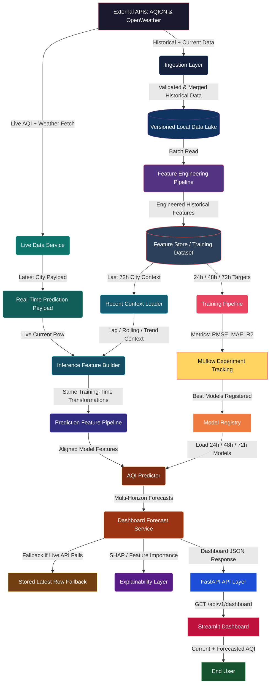
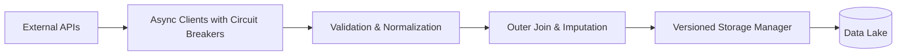
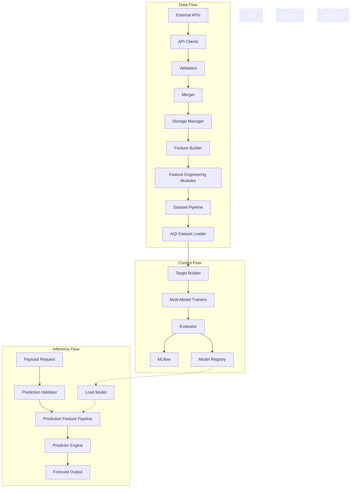

# AQI Forecasting MLOps Platform — Master Architecture Document

## Table of Contents
1. [Executive Architecture Overview](#1-executive-architecture-overview)
2. [Data Lineage & Flow (A → Z)](#2-data-lineage--flow-a--z)
3. [Phase-Wise Architecture Breakdown](#3-phase-wise-architecture-breakdown)
   - [3.1 Phase 1: Ingestion & Validation](#31-phase-1-ingestion--validation)
   - [3.2 Phase 2: Feature Engineering](#32-phase-2-feature-engineering)
   - [3.3 Phase 3: Dataset Pipeline & Feature Store Ops](#33-phase-3-dataset-pipeline--feature-store-ops)
   - [3.4 Phase 4: Training & Registry](#34-phase-4-training--registry)
   - [3.5 Phase 5: Multi-Horizon Inference](#35-phase-5-multi-horizon-inference)
4. [Deep-Dive File & Module Analysis](#4-deep-dive-file--module-analysis)
5. [System-Level Dependency Graph](#5-system-level-dependency-graph)
6. [Architectural Observations](#6-architectural-observations)

---

## 1. Executive Architecture Overview

The AQI Forecasting MLOps Platform is an end-to-end, multi-horizon (24h, 48h, 72h) air quality forecasting engine designed for high-availability enterprise environments. The core design philosophy revolves around strict separation of concerns, horizon-agnostic inference, defensive validation, and idempotent feature generation. The system explicitly separates feature engineering logic from model execution, ensuring that identical transformations are applied during historical training and real-time inference. Resiliency is built into the ingestion layer via circuit breakers, exponential backoff, and fallback schemas (e.g., AQI-only modes).

---

## 2. Data Lineage & Flow (A → Z)

The system ingests data from AQICN (air quality) and OpenWeather (meteorological) APIs. Ingestion can operate in real-time or historical backfill modes. The data journey emphasizes strict checkpointing, where schema mutations are documented and validated before proceeding to the next hop.

### 2.1 State Checkpoints

| Checkpoint Name | State Change | Description |
|-----------------|--------------|-------------|
| **[Input State: Raw JSON]** | `dict` → `APIModel` | Raw HTTP responses are parsed, null-filled (e.g., converting "-" to None), and bounds-checked. |
| **(Transformation Logic)** | *Fusion & Normalization* | AQI and Weather models are outer-joined on city and timestamp. Missing gaps are forward-filled, backward-filled, and linearly interpolated. |
| **[Output State: MergedFeature]** | `APIModel` → `MergedFeature` | A unified, normalized record containing location, weather (temp, humidity, etc.), AQI, and detailed pollutant levels. |
| **[Input State: MergedFeature]** | `MergedFeature` → `DataFrame` | Batch loading of historical or recent unified records. |
| **(Transformation Logic)** | *Feature Engineering* | Generation of temporal (time-based), spatial, lag (historical windows), rolling (moving averages), trend, and interaction features. |
| **[Output State: Feature Vector]** | `DataFrame` → `632-col DataFrame` | A massive tabular dataset comprising 626 input features, 3 target columns (shifted AQI), and metadata. |

### 2.2 Lineage Table

| Phase | Input Schema | Output Schema | State Characteristics |
|-------|--------------|---------------|-----------------------|
| **Ingestion** | Raw API JSON (AQICN, OpenWeather) | `MergedFeature` (or `AQIOnlyFeature`) | Stateless, Batch/Streaming capable |
| **Storage Ops** | `MergedFeature` objects | Parquet/CSV/JSON files (Versioned) | Stateful, Idempotent writes |
| **Feature Eng.** | Tabular `MergedFeature` schema | 632-column numeric/categorical DataFrame | Stateless transformations |
| **Training Prep** | 632-column DataFrame | Split DataFrames (Train/Val/Test) | Stateful (chronological split) |
| **Model Inference**| Real-time JSON payload + Feature Store Context | Scalar AQI Prediction | Stateless, strictly schema-aligned |

---

## 3. Phase-Wise Architecture Breakdown

### 3.1 Phase 1: Ingestion & Validation
- **Boundary**: Owns external API communication, schema validation, entity fusion (Weather + AQI), and raw storage. Explicitly does NOT own feature engineering or transformations beyond missing-value imputation.
- **Trigger Mechanism**: Scheduled orchestrators (e.g., Cron/Airflow) or manual CLI invocation for backfills.
- **Core Logic**:
  1. Asynchronously fetch data from AQICN and OpenWeather (with circuit breakers and token-bucket rate limiting).
  2. Validate payloads against strict domain rules (e.g., temperature bounds, AQI max limits) and normalize schemas.
  3. Merge asynchronous streams using an outer join on city and timestamp.
  4. Impute missing values via a cascading strategy: forward fill, backward fill, and linear interpolation.
  5. Persist batches to the local versioned storage in multiple formats (Parquet, JSON, CSV).
- **Failure Handling**: HTTP failures trigger exponential backoff. If Weather APIs fail or are disabled, the system gracefully degrades to produce an `AQIOnlyFeature` fallback record.
- **Outputs**: Versioned datasets in the raw data lake.

### 3.2 Phase 2: Feature Engineering
- **Boundary**: Owns the deterministic transformation of raw merged features into a wide, machine-learning-ready tabular format.
- **Trigger Mechanism**: Downstream calls during dataset building or real-time feature generation during inference.
- **Core Logic**:
  1. Extract temporal patterns (hour, day, seasonality, cyclical trigonometric encodings).
  2. Compute lag features across multiple historical windows (e.g., 1h to 72h delays).
  3. Generate rolling window statistics (mean, std, min, max, ema) for pollutants and weather.
  4. Calculate trend indicators (percentage changes, rate of change, momentum).
  5. Construct spatial and interaction features (e.g., temp-humidity combinations, pollutant ratios).
  6. Apply strict encoding and standard scaling (saving the scaler artifact).
- **Failure Handling**: Drops or imputes rows missing critical historical context based on configuration.
- **Outputs**: A massive 632-column dataset comprising 626 features, 3 shift-based targets, and metadata.

### 3.3 Phase 3: Dataset Pipeline & Feature Store Ops
- **Boundary**: Owns dataset construction, data quality verification, and feature store synchronization.
- **Trigger Mechanism**: Scheduled execution to refresh training sets or sync online feature stores.
- **Core Logic**:
  1. Compile all historical and live merged data.
  2. Execute a pre-cleaning quality check to log missingness and distributions.
  3. Clean the dataset (deduplication, finalizing imputation).
  4. Generate and persist comprehensive dataset statistics.
  5. Write final Parquet datasets and push aggregated entities to Feast/Hopsworks feature stores.
- **Outputs**: Cleaned `training_dataset.parquet`, `dataset_statistics.json`, and synced Feature Store tables.

### 3.4 Phase 4: Training & Registry
- **Boundary**: Owns algorithm execution, hyperparameter management, model evaluation, tracking, and artifact persistence.
- **Trigger Mechanism**: CLI commands or automated retraining triggers.
- **Core Logic**:
  1. Chronologically split the engineered dataset into Train, Validation, and Test sets.
  2. For each forecasting horizon (24h, 48h, 72h), isolate the specific target and drop other targets to prevent data leakage.
  3. Train a suite of candidate models (Ridge, Random Forest, HistGradientBoosting, XGBoost, LSTM, Prophet).
  4. Evaluate models against the test split, selecting the winner based on lowest Root Mean Square Error (RMSE).
  5. Log all parameters, metrics, and signatures to MLflow.
  6. Serialize the winning model and a rigid schema manifest to the local file registry.
- **Outputs**: `.joblib` / `.keras` model artifacts, comprehensive evaluation metrics, and MLflow tracking records.

### 3.5 Phase 5: Multi-Horizon Inference
- **Boundary**: Owns the transformation of real-time payloads into predictions using production models.
- **Trigger Mechanism**: API requests or batch processing scripts.
- **Core Logic**:
  1. Dynamically load the correct model artifact and scaler based on the requested horizon (24h, 48h, or 72h).
  2. Route the incoming payload through the identical feature pipeline used during training.
  3. Validate schema alignment, guaranteeing the exact 626-feature sequence (filling missing features with zeros if permissible).
  4. Execute model inference and return the forecasted AQI scalar.
- **Failure Handling**: Misaligned schemas are flagged and dynamically reindexed to prevent execution crashes.
- **Outputs**: Formatted prediction JSONs containing the forecasted value and model version.

---

## 4. Deep-Dive File & Module Analysis

### 4.1 `src/ingestion/`
| Path & Name | Core Responsibility | Logical Flow | Dependencies & Edges | Risk/Fragility Notes |
|-------------|---------------------|--------------|----------------------|----------------------|
| `api_client.py` | Provides resilient, async HTTP client primitives with rate limiting and circuit breakers. | 1. Initialize rate limiter/circuit breaker. 2. Attach UUID headers. 3. Execute HTTP request with exponential backoff. 4. Record latency metrics. | Upstream: None. Downstream: `aqi_client.py`, `weather_client.py`, `historical_client.py` | Circuit breaker timeouts may block execution globally if APIs suffer prolonged outages. |
| `aqi_client.py` | Fetches real-time air quality metrics from the AQICN API. | 1. Resolve API key. 2. Request `/feed/{city}/`. 3. Return JSON response. | Upstream: `api_client.py`. Downstream: `run_pipeline.py`, `merger.py` | ⚠️ Inference — verify: Dependent on stable API key resolution logic. |
| `weather_client.py` | Fetches current meteorological and pollution data from OpenWeather. | 1. Resolve API key. 2. Request weather endpoint. 3. Return JSON response. | Upstream: `api_client.py`. Downstream: `run_pipeline.py`, `merger.py` | None identified. |
| `historical_client.py` | Retrieves hourly historical weather data for specific timestamps. | 1. Calculate Unix timestamps. 2. Request OneCall API. 3. Return payload. | Upstream: `api_client.py`. Downstream: `historical_backfill.py` | Rate limits on OneCall historical endpoints can bottleneck backfills. |
| `historical_backfill.py` | Orchestrates bulk historical data retrieval across date ranges. | 1. Generate date range. 2. Loop through (city, date) pairs. 3. Fetch data. 4. Pass to storage. | Upstream: `historical_client.py`. Downstream: `storage.py` | Heavy memory footprint if date ranges span several years without batch yielding. |
| `validator.py` | Validates raw API JSON against strict Pydantic models. | 1. Normalize strings. 2. Execute Pydantic validation. 3. Check domain rules (e.g., temp limits). 4. Return robust models. | Upstream: All clients. Downstream: `merger.py`, `run_pipeline.py` | Strict validation will drop entire rows if underlying API schemas drift. |
| `merger.py` | Fuses validated AQI and Weather objects into a single feature record. | 1. Align timestamps. 2. Extract pollutants. 3. Forward/backward fill missing fields. 4. Return `MergedFeature`. | Upstream: `validator.py`. Downstream: `run_pipeline.py`, `storage.py` | Temporal misalignment between APIs could result in heavily interpolated (artificial) data. |
| `storage.py` | Manages versioned local persistence of dataset batches. | 1. Allocate version directory. 2. Serialize objects. 3. Save as Parquet, CSV, and JSON. 4. Write metadata with SHA-256 hashes. | Upstream: `merger.py`. Downstream: Dataset Pipeline. | Unbounded local versioning may consume disk space rapidly if cleanup isn't strictly enforced. |
| `run_pipeline.py` | Master orchestrator tying ingestion, validation, merging, and storage. | 1. Gather API payloads. 2. Validate. 3. Merge. 4. Handle batch storage and Feature Store sync. | Upstream: Clients, Validators, Merger, Storage. | Central point of failure; relies entirely on component stability. |

### 4.2 `src/feature_engineering/`
| Path & Name | Core Responsibility | Logical Flow | Dependencies & Edges | Risk/Fragility Notes |
|-------------|---------------------|--------------|----------------------|----------------------|
| `build_features.py` | Coordinates execution of all specific feature engineering modules. | 1. Receive data. 2. Sequentially call temporal, lag, rolling, etc. modules. 3. Return widened dataframe. | Upstream: Storage. Downstream: Dataset/Training Prep. | ⚠️ Inference — verify: Strict ordering is required; out-of-order execution breaks lag dependencies. |
| `temporal_features.py` | Computes calendar and time-based indicators. | 1. Parse timestamps. 2. Calculate cyclical trigonometric encodings. 3. Flag holidays/weekends. | Upstream: `build_features.py`. | Relies on perfect chronological sorting. |
| `lag_features.py` | Generates historical step-back variables. | 1. Group by city. 2. Apply shift logic over predefined windows. | Upstream: `build_features.py`. | Initial rows will inherently contain NaNs due to lack of historical context. |
| `rolling_features.py` | Computes moving averages and windowed statistics. | 1. Group by city. 2. Calculate rolling mean, std, etc. | Upstream: `build_features.py`. | Same NaN risk as lag features at dataset boundaries. |
| `trend_features.py` | Calculates rate-of-change and momentum. | 1. Compute percentage differences. 2. Apply momentum formulas. | Upstream: `build_features.py`. | Highly sensitive to zero-values (potential divide-by-zero risks). |
| `spatial_features.py` | Encodes geographic and locational data. | 1. Extract lat/lon. 2. One-hot encode station identifiers. | Upstream: `build_features.py`. | Static feature mapping; adding new cities requires schema updates. |
| `interaction_features.py`| Derives cross-variable contextual metrics. | 1. Compute ratios (e.g., PM2.5/PM10). 2. Compute heat indexes. | Upstream: `build_features.py`. | Domain-specific logic; highly sensitive to imputation accuracy in raw data. |
| `air_quality_features.py`| Enhances baseline pollutant readings. | 1. Categorize dominant pollutants. 2. Calculate custom index thresholds. | Upstream: `build_features.py`. | None identified. |
| `scaling_encoding.py` | Normalizes continuous variables and encodes categorical ones. | 1. Fit/Transform StandardScaler. 2. Apply one-hot encoding. 3. Export fitted scaler. | Upstream: `build_features.py`. Downstream: Inference pipeline. | State-dependent; applying a mismatched scaler during inference will destroy predictions. |

### 4.3 `src/dataset_pipeline/` & `src/feature_store/` & `src/feature_pipeline/`
| Path & Name | Core Responsibility | Logical Flow | Dependencies & Edges | Risk/Fragility Notes |
|-------------|---------------------|--------------|----------------------|----------------------|
| `build_training_dataset.py`| Orchestrates Phase 5 dataset compilation. | 1. Merge sources. 2. Quality check. 3. Clean. 4. Generate stats. 5. Write Parquet. | Upstream: `historical_dataset_builder.py`, `quality_checker.py`. | Strict execution aborts if `fail-on-issues` is triggered by bad data. |
| `quality_checker.py` | Assesses and scrubs dataset anomalies. | 1. Scan for NaNs. 2. Check distributions. 3. Impute/Drop based on strategy. | Upstream: Dataset builders. | Drops crucial data if thresholds are too aggressive. |
| `dataset_statistics.py` | Generates summary metadata for transparency. | 1. Calculate min/max/mean/std per column. 2. Save JSON. | Upstream: `quality_checker.py`. | None identified. |
| `historical_dataset_builder.py`| Consolidates various historical files into a unified frame. | 1. Scan directories. 2. Read Parquets. 3. Concat DataFrames. | Upstream: Storage layer. | Memory-intensive for massive data lakes. |
| `hopsworks_publisher.py`| Syncs offline features to an online store. | 1. Authenticate. 2. Create feature group. 3. Insert dataframe. | Upstream: Dataset builders. | Hopsworks network latency can drastically slow pipeline runs. |
| `feast_writer.py` | Writes to Feast offline stores. | 1. Format schema. 2. Write Parquet to specific local paths. | Upstream: Feature Engineering. | Highly coupled to Feast repository structure. |
| `feature_store.py`/`feature_definitions.py` / `data_source.py` | Feast repository definitions. | 1. Define FileSources. 2. Define Entities. 3. Define FeatureViews. | Upstream: Feast core. | Configuration files; low runtime risk. |

### 4.4 `src/training/`
| Path & Name | Core Responsibility | Logical Flow | Dependencies & Edges | Risk/Fragility Notes |
|-------------|---------------------|--------------|----------------------|----------------------|
| `forecast_targets.py` | Constructs multi-horizon labels. | 1. Group by city. 2. Shift AQI column negatively (-24, -48, -72). | Upstream: Training Dataset. | End-of-series data naturally loses targets (tail NaNs). |
| `dataset.py` | Manages Train/Val/Test splits and isolates features from targets. | 1. Load Parquets. 2. Select target horizon. 3. Drop contradictory targets and metadata. | Upstream: Feature Pipeline. Downstream: Trainers. | Crucial security layer preventing data leakage (target contamination). |
| `train_multi_models.py` | Executes comparative algorithm training per horizon. | 1. Loop algorithms. 2. Fit data. 3. Compute RMSE. 4. Select winner. | Upstream: `dataset.py`. Downstream: `registry.py`, `evaluate.py`. | Heavy computational load; requires multiprocessing/GPU for speed. |
| `train_*.py` (XGB, LSTM, Prophet) | Algorithm-specific implementations. | 1. Format data appropriately (e.g., 3D tensors for LSTM). 2. Train. 3. Return model. | Upstream: `dataset.py`. | Specialized architectures require differing input shapes, complicating generic orchestration. |
| `evaluate.py` | Generates deep evaluation artifacts. | 1. Predict on Test set. 2. Compute residual metrics. 3. Plot graphs. | Upstream: Trainers. | Visualization generation may crash headless servers lacking rendering backends. |
| `registry.py` | Maintains the versioned local model catalog. | 1. Read catalog. 2. Increment version. 3. Save Joblib/Keras files and metadata. | Upstream: Trainers. Downstream: Predictors. | Concurrent training runs might cause race conditions on the JSON catalog. |
| `run_pipeline.py` | The master training lifecycle orchestrator. | 1. Build features. 2. Iterate over horizons. 3. Train, Evaluate, Register. | Upstream: All training modules. | Central point of failure for model generation. |

### 4.5 `src/prediction/`
| Path & Name | Core Responsibility | Logical Flow | Dependencies & Edges | Risk/Fragility Notes |
|-------------|---------------------|--------------|----------------------|----------------------|
| `predictor.py` | Orchestrates inference logic for requested horizons. | 1. Load context. 2. Replicate feature engineering. 3. Align schemas exactly. 4. Predict. | Upstream: `feature_pipeline.py`, `load_model.py`. | ⚠️ Inference — verify: Strict feature alignment via `reindex` might mask upstream ingestion bugs by filling zeros silently. |
| `feature_pipeline.py` | Reconstructs the exact feature generation path for single payloads. | 1. Accept JSON payload. 2. Apply transformations. 3. Apply fitted scaler. | Upstream: Prediction requests. | Duplication of logic from `src/feature_engineering/`; requires extreme parity maintenance. |
| `load_model.py` | Fetches correct artifacts based on horizon requests. | 1. Parse registry. 2. Deserialize Joblib/Keras. 3. Load associated Scaler. | Upstream: Local Registry. | I/O bound; loading massive models real-time introduces latency. |
| `forecast.py` | Generates iterative or multi-step forward outlooks. | 1. Loop predictions iteratively. 2. Accumulate forecast array. | Upstream: `predictor.py`. | Error compounding: errors in step T heavily degrade predictions at T+N. |
| `validator.py` | Validates inference payloads prior to execution. | 1. Check schema matching. 2. Reject malformed requests. | Upstream: Inference requests. | None identified. |

---

## 5. System-Level Dependency Graph

---

## 6. Architectural Observations

- **Design Elegance (Idempotent Storage & Schema Manifests):** The architecture shines in its deployment of strict schema manifest JSONs alongside model artifacts. By forcing the `predictor.py` to `reindex` incoming dataframes against a frozen manifest, the system physically prevents shape-mismatch crashes (a notoriously common MLOps failure mode) during real-time inference.
- **Design Elegance (Target Isolation):** `AQIDatasetLoader` displays deep domain expertise by explicitly dropping future-horizon targets from the feature set before training. This is a textbook, highly effective mechanism to prevent data leakage.
- **Latent Risk (State Mismatch in Feature Engineering):** While the system separates feature engineering properly, having separate execution paths (Batch via `build_features.py` vs Real-time via `PredictionFeaturePipeline`) introduces an inherent risk of training-serving skew. If one module is updated without the other, the models will degrade rapidly.
- **Latent Risk (Error Compounding in Iterative Forecasts):** If `forecast.py` relies on autoregressive iteration (feeding $T_{prediction}$ into $T+1_{input}$), the compounding error risk is extreme, especially given the heavy reliance on rolling and lagged features which magnify noise.
- **Missing Elements (Fallback Telemetry):** While `APIClient` correctly uses circuit breakers, there is limited visibility in the code (beyond log traces) for tracking the exact volume of degraded `AQIOnlyFeature` records entering the training pipeline, which could secretly shift dataset distributions if Weather APIs remain down for weeks.
