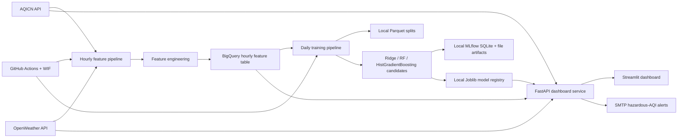
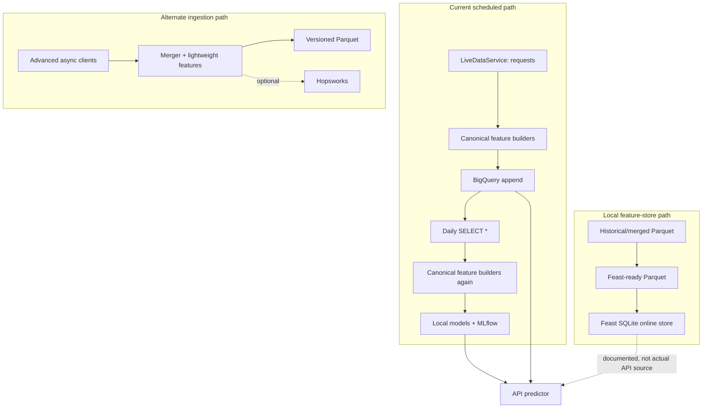
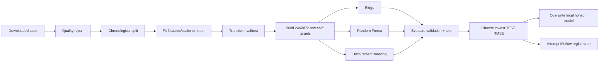

# AQI Forecasting MLOps — Comprehensive Technical Audit

**Audit date:** 2026-08-03  
**Repository:** `D:\10Pearls\aqi-forecasting-mlops`  
**Audit mode:** static, read-only inspection of source, configuration, workflows, tests, documentation, metadata, and locally available artifacts; no external services were invoked and no secrets are reproduced.

## 1. Executive assessment

The repository is a substantial prototype with real implementations for ingestion, feature engineering, multi-model training, MLflow tracking, a BigQuery-backed feature pipeline, a FastAPI dashboard API, Streamlit visualization, alerting, and GitHub Actions automation. It is **not production-ready in its current state**. The main issue is not lack of code; it is that several overlapping implementations form incompatible paths, while the nominal production path has correctness, reproducibility, security, and operability gaps.

The highest-risk confirmed findings are:

1. **Model selection uses the test set.** `src/training/train_multi_models.py:80-141` selects the winning candidate by `test_metrics["rmse"]`. This leaks the holdout into model selection and makes reported test performance optimistic.
2. **The hourly table is treated as both an engineered feature store and raw training input.** `src/feature_pipeline/run_pipeline.py:411-469` writes schema-aligned engineered rows, while `src/training/run_pipeline.py` downloads `SELECT *` and runs the full feature builder again. This creates training/serving semantic drift and can overwrite or duplicate engineered columns.
3. **The forecast CLI labels repeated 24/48/72-hour direct predictions as every intervening hour.** `src/prediction/forecast.py:59-100` freezes the latest covariates and applies one direct-horizon model to many timestamps. Those are not genuine 1…72-hour trajectories.
4. **The scaler required at inference is not produced by a clean feature-build run.** `src/feature_engineering/build_features.py:72-111` fits/transforms, but never persists the engineer/scaler; the workflow later uploads `data/training/scaler.joblib`. A stale local file can hide this in development.
5. **Startup is fragile and over-coupled.** `src/configs/settings.py:170` constructs global settings during import; `src/api/routes.py:10` constructs the dashboard service during import. Health endpoints therefore depend on credentials, model files, scaler files, BigQuery initialization, and other heavyweight dependencies.
6. **The API has no authentication and uses wildcard CORS with credentials.** `src/api/app.py:14-20` allows every origin and credentials; routes expose expensive live-data, model, SHAP, and possible email-alert operations without rate limits.
7. **A tracked diagnostic script prints secrets.** `test_env.py:6-10` prints API-key environment variables. No secret values were reproduced in this audit.
8. **Daily training deletes MLflow state on every run.** `.github/workflows/training_pipeline.yml:174-188` removes `mlflow.db` and `mlruns`, eliminating durable registry history and promotion state before retraining.
9. **Clean-checkout reproducibility is absent.** Dependencies are almost entirely unpinned, Feast and Hopsworks imports are undeclared, notebooks need undeclared Seaborn, configuration examples are incomplete, and no lockfile or packaging metadata exists.
10. **Current automated test status is not verifiable.** Tests are not executed by either workflow. The available environment lacks the project runtime and pytest dependencies; cached pytest metadata records many prior failures but is not evidence of current results.

### Readiness scores

| Dimension | Score | Assessment |
|---|---:|---|
| Architecture coherence | 4/10 | Major components exist, but there are duplicate ingestion/feature-store/registry paths and no single enforced production contract. |
| Data correctness | 4/10 | Chronological splitting is present, but global imputation, row-based horizons, invalid source values, and table semantics create leakage and alignment risks. |
| ML methodology | 3/10 | Multiple models and metrics are implemented; test-set model selection, synthetic Prophet time, a one-step LSTM, and weak promotion invalidate production claims. |
| Reproducibility | 2/10 | No lockfile, unpinned dependencies, missing declared packages, stale local artifacts, cwd-dependent paths, and reset MLflow history. |
| Security | 3/10 | WIF is a good foundation, but unauthenticated expensive endpoints, secret-printing code, unsafe model deserialization, unpinned actions, and error leakage remain. |
| Reliability/observability | 4/10 | Retries, a circuit breaker, structured logs, and some metrics exist, but are inconsistently applied and are not exposed as a coherent operational system. |
| Testing | 3/10 | Good unit-test volume in several modules, but important suites are empty, external tests are unsafe, cached failures exist, and CI runs no tests. |
| Deployment readiness | 2/10 | Scheduled data/training workflows exist, but no serving deployment, promotion gate, rollback, environment separation, or durable artifact/registry contract exists. |
| **Overall** | **3/10** | **Feature-complete prototype; not yet a trustworthy production MLOps system.** |

### Evidence classification

This report uses the following labels:

| Label | Meaning |
|---|---|
| **Confirmed** | Directly demonstrated by repository code, tracked metadata, or readable local artifact metadata. |
| **Partial** | Implemented, but incomplete, inconsistent, or not wired into the main path. |
| **Config-only** | Declared in configuration/workflows without an end-to-end implementation. |
| **Stub** | Empty or effectively empty placeholder. |
| **Planned/docs-only** | Described in prose or diagrams but not present in executable code. |
| **Inference** | Reasoned consequence of confirmed code; called out as such. |
| **Not verifiable** | Requires live credentials, cloud state, a runnable project environment, or runtime evidence not available in the repository. |

## 2. Scope, method, and limitations

### What was inspected

- All Python source and test files, including module-level side effects and entry points.
- Both GitHub Actions workflows and repository configuration files.
- `.gitignore`, `.env.example`, environment-variable **names only**, and Git history checks for `.env`/credential-file tracking. Secret values were never included.
- Markdown/HTML architecture documentation and notebook metadata/imports.
- JSON statistics/reports and metadata adjacent to local models and training splits.
- The local MLflow SQLite schema in read-only mode: experiment/run/model/version counts, stages, aliases, and artifact-location shape.
- Git status and tracked/ignored artifact boundaries.
- Python AST parsing for all 111 Python files.

### What was deliberately not done

- No AQICN, OpenWeather, BigQuery, Hopsworks, SMTP, GitHub, or other external service was called.
- No training, prediction, schema mutation, email delivery, artifact cleanup, or destructive operation was run.
- No secret value, credential, token, or password was printed or copied.
- No application source, workflow, configuration, data, model, or user-owned change was modified. This report is the sole added artifact.

### Verification limitations

- A current pytest run was **not possible** in the available execution environment: the repository’s zero-byte tracked file named `python` shadows a normal command in this workspace, and the bundled audit runtime lacks pytest plus core project packages such as pandas, PyArrow, scikit-learn, PyYAML, and MLflow. Installing dependencies would mutate the environment and, without a lockfile, would not provide a reproducible result.
- `.pytest_cache/v/cache/lastfailed` records prior failures across settings, API client, merger, pipeline, storage, validator, and weather tests. This is historical cache evidence only, not a current test result.
- Cloud IAM grants, table partitioning/clustering, active dataset expiration, live MLflow/UI state, GitHub secret configuration, deployed API behavior, and SMTP delivery are **not verifiable** from the repository alone.
- Binary model quality was not independently re-evaluated. Reported metrics below come from local metadata and are explicitly identified as such.

## 3. Repository discovery and artifact hygiene

### Top-level inventory

| Area | Observed contents | Audit status |
|---|---|---|
| Application source | `src/` with configs, ingestion, feature engineering, stores, training, prediction, API, dashboard, alerts, explainability | Confirmed, substantial |
| Automation | `.github/workflows/hourly_feature_pipeline.yml`, `training_pipeline.yml` | Confirmed, active by schedule and manual dispatch |
| Tests | 13 root test/diagnostic scripts plus 10 files under `tests/` | Partial; four empty suites and no CI test job |
| Feature repository | `feature_repo/` Feast definitions and local SQLite stores | Partial; local/offline path exists, not the main BigQuery path |
| Data | Tracked Feast/training Parquet files plus larger ignored local splits/versions | Mixed source and generated artifacts |
| Models/MLflow | Ignored local models, `mlflow.db`, and `mlruns/` | Local state exists; not durable or committed |
| Reports/notebooks | EDA notebooks, JSON stats, dozens of PNGs, HTML exports | Useful evidence; several stale or empty artifacts |
| Configuration | `.env.example`, three empty YAML files, settings code | Incomplete and contradictory |
| Packaging | `requirements.txt` only | No project metadata, lockfile, build configuration, lint/type/test configuration, or README |

### Git and generated artifacts

- **Confirmed:** `.env`, `mlflow.db`, `mlruns/`, `models/`, Parquet patterns, and training logs are ignored by `.gitignore`.
- **Confirmed:** `.env` is not tracked and no `.env` history was found. No tracked or historical service-account JSON, PEM, or private-key file was found.
- **Confirmed:** the worktree already contained a user-owned modification in `src/feature_engineering/rolling_features.py`; the audit did not alter it.
- **Confirmed:** generated artifacts are nevertheless already tracked: two main Parquet datasets, Feast SQLite databases, about 8 MB of logs, about 6.3 MB of reports, and about 8.4 MB of notebooks. Ignore rules do not remove files that were committed earlier.
- **Confirmed:** `cls`, `echo`, and `python` are tracked zero-byte shell detritus. `get-pip.py` is a tracked ~2.2 MB bootstrap script. These should not be product source.
- **Confirmed:** `LICENSE` contains only `VNPDA3PVIV7T3NTE`, which is not an identifiable open-source license grant.
- **Confirmed:** locally present ignored data includes roughly 121 MB/30 MB/30 MB train/validation/test splits, a scaler, multiple Joblib/Keras models, prediction outputs, and versioned datasets. These can make local runs appear healthy while a clean checkout fails.

### Data artifact facts visible in checked-in reports

`src/dataset_pipeline/dataset_statistics.py` produced metadata indicating 105,054 rows, 35,018 per city, covering 2022-07-21 through 2026-07-18. The report also records AQI up to 538 and ozone down to -11. Yet the quality report declares the dataset clean because `src/dataset_pipeline/quality_checker.py` focuses on missingness, duplicates, and gaps—not domain bounds. Therefore “clean” does not mean physically valid.

## 4. System architecture

### System context

### Actual competing paths

The architectural problem is visible in the graph: BigQuery, Feast, Hopsworks, versioned Parquet, a custom JSON registry, MLflow Registry, and local model folders coexist without a declared system of record. The scheduled path uses BigQuery plus local artifacts; the more sophisticated async ingestion stack and Feast/Hopsworks paths are largely parallel implementations.

### Component status

| Component | Status | Evidence-based assessment |
|---|---|---|
| AQICN ingestion | Confirmed | Implemented in advanced async, simple async, historical, and synchronous live variants. Duplication causes policy drift. |
| OpenWeather ingestion | Partial | Implemented, but one client references a nonexistent revealed-key property; weather-disable mode still constructs the client in the alternate pipeline. |
| Data validation | Partial | Strong Pydantic structure in one path; historical and live paths bypass or weaken it. Domain validity is incomplete. |
| Canonical feature engineering | Confirmed | Rich lag, rolling, temporal, trend, interaction, spatial, scaling/encoding pipeline. Stateful and dynamic-schema behavior is not safely versioned. |
| BigQuery feature store | Confirmed | Read and append-load operations exist. No idempotent upsert, partition/clustering management, or cost controls. |
| Feast | Partial | Definitions, Parquet writer, and local SQLite exist; no evidence of scheduled materialization or serving integration. |
| Hopsworks | Config-only/partial | Imports and optional upload code exist, but dependency/config contract is missing and failures are swallowed. |
| Training | Confirmed | Three direct horizons and three active candidate types. Methodological defects prevent trustworthy promotion. |
| MLflow | Partial | Local tracking and registry data exist; daily workflow resets them, and no aliases/gates/promotion exist. |
| Prediction | Partial | Direct point predictions work conceptually; trajectory CLI semantics and permissive feature alignment are unsafe. |
| FastAPI | Confirmed | Five GET endpoints exist. No serving deployment, authentication, rate limiting, readiness, or clean app lifecycle. |
| Streamlit | Confirmed | Functional client-side dashboard code, hardcoded local API URL, no caching/staleness/failure strategy. |
| Email alerts | Partial | SMTP service and hazardous wrapper exist. No deduplication/cooldown; dashboard reads can trigger delivery. |
| Observability | Partial | JSON rotating logs and in-process metrics exist. No coherent metrics endpoint, tracing export, SLO, freshness, or drift monitoring. |

## 5. File-by-file master audit

The table below accounts for every relevant readable implementation/configuration file. Empty package `__init__.py` files are legitimate package markers unless otherwise noted. Generated binary figures, database pages, Parquet row groups, and model binaries are catalogued by directory because they are artifacts rather than readable source.

### Entry points, configuration, and utilities

| File | Role | Status and key findings |
|---|---|---|
| `main.py` | Unified CLI | **Partial.** Imports heavyweight modules at startup, so unrelated commands inherit settings/dependency failures. Train output labels test RMSE as validation RMSE (`main.py:127-130`); some horizon arguments do not constrain the underlying all-horizon pipeline. |
| `src/__init__.py` | Package marker | Empty; appropriate. |
| `src/configs/__init__.py` | Config package export | Small package surface; global settings behavior originates in `settings.py`. |
| `src/configs/settings.py` | Active Pydantic settings | **Confirmed, critical coupling.** Clear precedence is documented/implemented (`:6-8`, `:123-138`), but required secrets are resolved on import (`:170`), directories are created during settings construction (`:140-145`), and paths resolve against process cwd. No `openweather_api_key_revealed` property exists. |
| `src/configs/models.py` | Alternate config models | **Partial/duplicate.** Defines models overlapping `settings.py`; not the effective runtime contract. |
| `src/configs/loaders.py` | YAML/environment loader | **Partial.** Supports a configuration path whose repository YAML inputs are empty and whose models differ from active settings. |
| `src/configs/validators.py` | Config validators | **Partial.** Validation helpers are not consistently used by the active settings path. |
| `src/configs/exceptions.py` | Config exception types | Implemented but tied mainly to the alternate config stack. |
| `src/configs/constants.py` | Config constants | Small constants module; contributes to duplicated configuration ownership. |
| `src/utils/logger.py` | Async structured JSON logging | **Confirmed/partial.** Queue-based rotating logs are useful, but log location is cwd-dependent and correlation/request context defaults to `SYSTEM`; no request middleware sets it. |
| `src/utils/constants.py` | Project/model constants | **Partial.** `EXPECTED_FEATURE_COUNT = 626` at `:44` conflicts with local active metadata reporting 618 features and is not enforced by dataset loading. |
| `src/utils/helpers.py` | Intended helper module | **Stub; empty.** |
| `configs/config.yaml` | Base configuration | **Stub; zero bytes.** |
| `configs/feature_config.yaml` | Feature configuration | **Stub; zero bytes.** |
| `configs/model_config.yaml` | Model configuration | **Stub; zero bytes.** |
| `.env.example` | Local configuration template | **Incomplete.** Contains only flat city/country examples; active settings require API keys and use nested names such as `LOCATION__CITY`. |
| `.gitignore` | Artifact/secret policy | Generally sensible, but several generated files were committed before ignore rules and remain tracked. |
| `requirements.txt` | Runtime dependencies | **High risk.** Mostly unpinned; lacks Feast, Hopsworks, and notebook Seaborn; mixes API, ML, notebook, cloud, observability, and deep-learning stacks in every job. |
| `upload_only.py` | Hopsworks smoke upload | **Experimental.** Module-level login/write, hardcoded project name, undeclared Hopsworks dependency, no safe CLI boundary, and mojibake output. Not part of workflows. |
| `get-pip.py` | pip bootstrap | Unrelated generated/vendor bootstrap (~2.2 MB); should not be tracked in product source. |
| `cls`, `echo`, `python` | Shell detritus | **Zero-byte accidental files.** `python` can shadow command discovery in this workspace. |
| `LICENSE` | Intended license | Contains only an opaque 16-character string; no usable license terms. |

### Ingestion and storage

| File | Role | Status and key findings |
|---|---|---|
| `src/ingestion/__init__.py` | Package marker | Empty; appropriate. |
| `src/ingestion/api_client.py` | Advanced async HTTP client | **Confirmed/partial.** Has rate limiting, retries, cache, circuit breaker, and metrics. Transport retries plus Tenacity can multiply calls (`:143-151`, `:181-201`); circuit state is not synchronized; query-string secrets may reach cache/errors; pagination’s `HTTPStatusError` branch is unreachable after wrapping. |
| `src/ingestion/aqi_client.py` | Typed AQICN client | **Confirmed.** Uses the advanced client and validation. City path is not explicitly URL-encoded; behavior depends on HTTP client path handling. |
| `src/ingestion/weather_client.py` | Typed OpenWeather client | **Broken construction.** References nonexistent `settings.openweather_api_key_revealed` (`:127-129`). Maps `rain=` while schema expects `rain_mm`, silently yielding zero. Timezone conversion adds an offset while retaining a UTC label. |
| `src/ingestion/validator.py` | Pydantic response schemas | **Confirmed/partial.** Useful shape/domain checks, but default `extra="ignore"` can hide upstream drift; error objects can retain raw payload; UTC helpers return naive datetimes in places. |
| `src/ingestion/merger.py` | AQI/weather merge and imputation | **Partial.** Does not validate source timestamp skew; output time comes from weather. Pollutant missingness is mean-filled from the current batch, then zero if entirely absent (`:468-485`), which is unstable for a three-city run. |
| `src/ingestion/storage.py` | Versioned Parquet/CSV/JSON storage | **Substantial/partial.** Atomic-ish version workflow, checksums, backup/restore, retention. Serialization always expects `created_at` (`:169-195`), but AQI-only features do not define it. Full-directory restore/cleanup lacks locking; internal path inputs are weakly constrained. |
| `src/ingestion/run_pipeline.py` | Alternate end-to-end async ingestion | **Partial.** Weather optionality is documented, but the weather client is still constructed before the flag is honored (`:728-749`). AQI-only serialization breaks on `created_at`; Hopsworks failures are swallowed; Prometheus/OpenTelemetry objects are not exposed/exported. |
| `src/ingestion/historical_client.py` | Open-Meteo historical fetch | **Partial.** Free bulk backfill is useful, but `timezone=auto` timestamps are relabeled UTC rather than converted (`:213`); missing AQI becomes zero and domain validation is absent. |
| `src/ingestion/historical_backfill.py` | Historical orchestration | **Partial.** Drives the historical client and writes data; shares the client’s timezone/domain risks and is not integrated with the scheduled production workflow. |

### Feature engineering, feature stores, and dataset construction

| File | Role | Status and key findings |
|---|---|---|
| `src/feature_engineering/__init__.py` | Package marker | Empty; appropriate. |
| `src/feature_engineering/temporal_features.py` | Calendar/cyclical features | **Confirmed.** Relies on timestamp normalization; correctness inherits upstream timezone semantics. |
| `src/feature_engineering/lag_features.py` | Per-city lag features | **Confirmed/partial.** Uses row shifts as hourly lags; without a strict hourly cadence, “hour” semantics can drift. |
| `src/feature_engineering/rolling_features.py` | Per-city rolling statistics | **Confirmed.** Rich windows; row-count windows assume regular cadence. A pre-existing user whitespace/newline change was not modified by this audit. |
| `src/feature_engineering/trend_features.py` | Trend/change features | **Confirmed.** Same cadence dependency; creates many derived values. |
| `src/feature_engineering/interaction_features.py` | Interaction features | **Confirmed.** Adds multiplicative/composite columns; increases schema and multicollinearity burden. |
| `src/feature_engineering/air_quality_features.py` | Pollutant composites | **Confirmed, leakage risk.** `pollution_index` min-max normalizes on whichever full frame is passed (`:137-169`), so validation/test/inference transformations are not based on train-fitted state. |
| `src/feature_engineering/spatial_features.py` | City/station spatial features | **Partial.** Dynamic one-hot encoding can produce different schemas; station categories may create high cardinality and location leakage. |
| `src/feature_engineering/scaling_encoding.py` | Imputation/scaling/encoding | **Partial.** Train fitting exists; optional forward mode uses `ffill().bfill()` (`:139`), allowing future values to fill earlier gaps. Categories over 50 values may remain raw objects. Fitted object is not persisted by the main builder. |
| `src/feature_engineering/pipeline_steps.py` | Pipeline helpers/selection | **Partial.** VIF checks only a small selected subset, so it does not validate the hundreds of final features. |
| `src/feature_engineering/build_features.py` | Canonical split/build entry point | **Confirmed with major gap.** Chronological split before feature fitting is good (`:72-111`), but no scaler/engineer persistence occurs. Splitting before lags also discards boundary context. |
| `src/feature_pipeline/__init__.py` | Package marker | Empty; appropriate. |
| `src/feature_pipeline/run_pipeline.py` | Scheduled hourly feature job | **Confirmed/critical.** Reads recent BigQuery/local context, fetches live data, engineers, aligns to table schema, fills missing columns, and appends. Precise live timestamps and append-only writes are not idempotent; alignment can silently insert nulls. |
| `src/feature_pipeline/feature_engineering.py` | Lightweight ingestion features | **Partial/duplicate.** Reuses merger serialization and provides a smaller feature set distinct from the canonical training feature stack. |
| `src/feature_pipeline/feast_writer.py` | Feast Parquet writer | **Partial.** Exact city/timestamp deduplication exists, but every append reads/concatenates/rewrites the full file and has no concurrency protection. |
| `src/feature_pipeline/feature_store.py` | Intended abstraction | **Stub; empty.** |
| `src/feature_pipeline/feature_validation.py` | Intended validation | **Stub; empty.** |
| `src/feature_pipeline/preprocessing.py` | Intended preprocessing | **Stub; empty.** |
| `src/feature_store/bigquery_feature_store.py` | BigQuery read/write adapter | **Confirmed/critical.** Uses parameterized city queries and load-job append. `SELECT *` training download (`:77-85`) is unbounded; append uses `WRITE_APPEND` (`:216`) after only within-batch deduplication. No existing-row uniqueness, partition/clustering controls, retry/timeout, or maximum-bytes guard. |
| `src/dataset_pipeline/build_training_dataset.py` | Dataset orchestrator | **Partial.** Builds from local sources; scheduled training uses a different direct BigQuery synchronization path. |
| `src/dataset_pipeline/historical_dataset_builder.py` | Merge versioned historical sources | **Confirmed/alternate.** Deduplicates exact city/timestamp keys, but is not the daily workflow’s source. |
| `src/dataset_pipeline/quality_checker.py` | Quality repair/reporting | **Confirmed with leakage.** Global mean filling is computed before train/validation/test split (`:193-219`) and across cities/time. Checks do not reject reported AQI >500 or negative ozone. |
| `src/dataset_pipeline/dataset_statistics.py` | Dataset profile generation | **Confirmed.** Useful metadata exposed the out-of-domain values; no enforcement follows. |

### Training, registry, evaluation, and explainability

| File | Role | Status and key findings |
|---|---|---|
| `src/training/__init__.py` | Package marker | Empty; appropriate. |
| `src/training/forecast_targets.py` | Direct horizon targets | **Confirmed/critical.** `groupby(...).shift(-horizon)` (`:95-100`) treats rows as hours; gaps/duplicates make horizons temporally wrong. |
| `src/training/dataset.py` | Split loading/schema alignment | **Partial.** Intersects columns across splits and fills missing values with zero; expected feature count is accepted but not enforced. Silent intersection can hide feature-generation drift. |
| `src/training/train_multi_models.py` | Active candidate training | **Confirmed/critical.** Trains Ridge, Random Forest, and HistGradientBoosting. Chooses the winner on test RMSE (`:80-141`), logs it, catches registry errors, and overwrites local horizon artifacts with static version metadata. |
| `src/training/Ridgetrain.py` | Standalone Ridge baseline | **Experimental.** Saves a separate Ridge artifact (`:112`); filename casing and paths conflict with registry imports. Not active in scheduled winner training. |
| `src/training/train_xgboost.py` | Standalone XGBoost | **Experimental.** Separate run/registration and local artifact; not an active candidate in `train_multi_models.py`. |
| `src/training/train_lstm.py` | Standalone Keras LSTM | **Experimental/misleading.** Reshapes tabular data to one time step, so it is not learning a historical sequence. Uses the same shared registered-model name as other standalone scripts. |
| `src/training/train_prophet.py` | Standalone Prophet | **Experimental/invalid time basis.** Reconstructs synthetic dates starting 2026-01-01 for each split (`:48-55`) because timestamps were dropped; logs through the sklearn flavor and is not active in scheduled comparison. |
| `src/training/run_pipeline.py` | Daily training orchestration | **Confirmed/critical.** Downloads the BigQuery table, rebuilds features, creates targets/splits, trains all horizons. It conflates engineered table rows with raw input and does not save the scaler. |
| `src/training/evaluate.py` | Model evaluation/reporting | **Partial/broken multi-horizon CLI.** Defaults to the 24-hour artifact; the CLI loop reuses that evaluator for 48/72-hour splits and overwrites report paths. |
| `src/training/registry.py` | Custom JSON model registry | **Broken/unused.** Imports nonexistent `src.training.train` (`:17`, `:158`), conflicts with `Ridgetrain.py`, has no artifact hash/signature, locking, or rollback, and sorts semantic versions lexicographically. |
| `src/explainability/__init__.py` | Package marker | Empty; appropriate. |
| `src/explainability/dashboard_explainer.py` | Runtime SHAP/fallback importance | **Partial.** Sensible fallbacks, but expensive in request path and explanations inherit permissive feature fabrication/model validity. |
| `src/explainability/shap_analysis.py` | Standalone SHAP analysis | **Experimental.** Default registry path is duplicated (`models/registry/registry/...`) and module-level execution creates import side effects. |
| `src/explainability/lime_analysis.py` | Standalone LIME analysis | **Experimental.** Same path issue and module-level execution; not used by dashboard/API. |

### Prediction, API, dashboard, and alerts

| File | Role | Status and key findings |
|---|---|---|
| `src/prediction/__init__.py` | Package marker | Empty; appropriate. |
| `src/prediction/load_features.py` | BigQuery/local feature loader | **Confirmed/partial.** Fetches limited context from BigQuery with local fallback; source-of-truth and freshness are not surfaced robustly. |
| `src/prediction/load_model.py` | Local model/scaler loader | **Confirmed/critical trust boundary.** Loads Joblib artifacts from disk with no signature/hash verification. Requires a scaler a clean build does not create. |
| `src/prediction/feature_pipeline.py` | Serving feature transformation | **Partial.** Catches broad transformation errors and attempts fallback alignment (`:109-117`), potentially concealing a corrupt/incompatible fitted pipeline. |
| `src/prediction/validator.py` | Feature completeness validator | **Confirmed/partial.** Can measure mismatches, but callers can proceed below threshold. |
| `src/prediction/predictor.py` | Single-model prediction | **Partial.** `strict_feature_alignment` defaults false (`:128-145`); missing features can be fabricated as zero, masking training-serving skew. |
| `src/prediction/forecast.py` | 72-hour forecast CLI | **Semantically incorrect.** Repeats direct-horizon predictions over many timestamps with frozen inputs (`:59-100`) and may use the last row across cities. |
| `src/prediction/live_data_service.py` | Synchronous live ingestion | **Confirmed/duplicate.** Uses `requests`, separate parsing/retry/default rules, and can log raw error text. It bypasses the advanced clients and central validation. |
| `src/prediction/dashboard_service.py` | Dashboard aggregation | **Confirmed with high operational risk.** Loads models and BigQuery eagerly, reads full history per request, performs live calls/predictions/explanations, can send three alert emails per refresh (`:509`), uses test RMSE as heuristic confidence (`:401-406`), and compares pollutants with incompatible units. |
| `src/api/__init__.py` | Package marker | Empty; appropriate. |
| `src/api/app.py` | FastAPI application | **Confirmed/security gap.** Module-global app, wildcard origins plus credentials (`:14-20`), no authentication/rate limits/lifespan/readiness/metrics. |
| `src/api/routes.py` | HTTP routes | **Confirmed.** Global service construction at `:10`; catches exceptions and exposes `str(err)` at `:28`, `:46`, `:68`. |
| `src/api/schemas.py` | Response contracts | **Partial.** Typed dashboard responses are useful. `CurrentAQIResponse` lacks the `source` field inserted by the service, so Pydantic drops stored-vs-live provenance. |
| `src/dashboard/__init__.py` | Package marker | Empty; appropriate. |
| `src/dashboard/components.py` | Streamlit rendering helpers | **Confirmed.** Rich cards/charts and CSS; correctness depends on API response semantics. |
| `src/dashboard/streamlit_app.py` | Streamlit entry point | **Confirmed/partial.** API base is hardcoded to `127.0.0.1:8000`, timeout is 180 seconds, and there is no cache, freshness indication, degraded mode, or deploy-time configuration. |
| `src/alerts/aqi_alert_service.py` | Hazardous-AQI wrapper | **Partial.** Threshold/wrapper exists, but no idempotency, cooldown, or durable notification ledger. |
| `src/alerts/email_alert_service.py` | SMTP sender | **Confirmed/partial.** STARTTLS is configurable; delivery failures return false. Recipient addresses are logged, and no retry/dead-letter/alert status store exists. |
| `src/alerts/alert_manager.py` | Intended alert management | **Stub; empty.** |
| `src/alerts/thresholds.py` | Intended threshold policy | **Stub; empty.** |

### Feast repository

| File | Role | Status and key findings |
|---|---|---|
| `feature_repo/__init__.py` | Package marker | Empty; appropriate. |
| `feature_repo/entities.py` | Feast entity definitions | **Partial.** Defines city/entity contract for the local Feast path. |
| `feature_repo/data_source.py` | Feast Parquet source | **Partial.** Points at a local file and is not the scheduled BigQuery source. |
| `feature_repo/feature_definitions.py` | Feast feature views | **Partial.** Absolute local imports assume Feast CLI cwd; schema covers the lightweight feature set rather than the canonical ~600-feature training space. |
| `feature_repo/feature_store.yaml` | Feast provider/store config | **Confirmed local-only.** Uses local provider/SQLite state; not a cloud production store. |
| `feature_repo/verify_online_store.py` | Feast smoke verification | **Diagnostic.** Verifies local store manually; no workflow invokes it. |
| `feature_repo/feature_repo/__init__.py` | Nested package marker | Empty; nested package appears accidental/redundant. |

### Tests and diagnostics

| File | Role | Status and key findings |
|---|---|---|
| `test_settings.py` | Settings tests | 32 tests, broad intended coverage. Several expectations do not match active settings, including missing revealed-key properties (`:222-224`). Cached failures exist. |
| `test_run_pipeline.py` | Alternate pipeline tests | 27 tests, useful async/degradation/storage coverage. Cached failures exist; does not prove scheduled BigQuery path. |
| `test_aqi_client.py` | AQICN client tests | 7 tests; useful typed-client unit coverage. |
| `test_aqi_alert_service.py` | Alert test | One test; directly mocks/calls the lower-level alert service rather than exercising `send_hazardous_alert`, so wrapper behavior is not covered. |
| `test_email_alert.py` | SMTP integration script/test | One live delivery test; unsafe for normal CI without explicit integration markers and protected configuration. |
| `test_bigquery_connection.py` | Cloud connectivity test | One live BigQuery check; credentials and cloud state required. |
| `test_bigquery_feature_append.py` | BigQuery write test | One external mutation; can append production-like data and has no isolation fixture/cleanup contract. |
| `test_bigquery_prediction_context.py` | BigQuery context test | One live read; useful smoke test, not deterministic unit coverage. |
| `test_bigquery_training_schema.py` | BigQuery schema test | One live schema check; table must already exist. |
| `test_live_data_service.py` | Live API smoke test | One external-network test; non-deterministic and credential-dependent. |
| `test_env.py` | Environment diagnostic | **Security defect.** Prints API secret values at `:6-10`; contains no test function. |
| `test_historical.py` | Historical backfill script | Executes network/work at module import and contains no test function; pytest collection can cause side effects. |
| `test_logger.py` | Logger demonstration | Diagnostic script, not assertions-based test coverage. |
| `tests/test_api_client.py` | Advanced HTTP client tests | 19 tests; strong intended unit coverage for retry/rate/circuit behavior. Cached module failure exists. |
| `tests/test_merger.py` | Merger tests | 28 tests; strong intended branch coverage. Cached module failure exists. |
| `tests/test_storage.py` | Storage tests | 29 tests; substantial version/storage coverage. Cached module failure exists. |
| `tests/test_validator.py` | Response validation tests | 37 tests; strongest unit-test area. Cached module failure exists. |
| `tests/test_weather_client.py` | Weather client tests | 17 tests; useful coverage, but current missing settings property is a construction defect. Cached module failure exists. |
| `tests/test_end_to_end_pipeline.py` | Local end-to-end tests | Four parameterized tests; depend on ignored local models/scaler/data and write outputs, so not clean-checkout reproducible. |
| `tests/test_features.py` | Intended feature tests | **Stub; empty.** |
| `tests/test_ingestion.py` | Intended ingestion tests | **Stub; empty.** |
| `tests/test_prediction.py` | Intended prediction tests | **Stub; empty.** |
| `tests/test_training.py` | Intended training tests | **Stub; empty.** |

### Workflows, documentation, notebooks, and artifacts

| File/directory | Role | Status and key findings |
|---|---|---|
| `.github/workflows/hourly_feature_pipeline.yml` | Hourly scheduled job | **Active/partial.** Runs at minute 17 UTC each hour, WIF auth, 30-minute timeout, concurrency guard. Installs the entire unpinned stack, validates secrets, runs append-only hourly pipeline, and sends failure email. No tests, artifact diagnostics, or SHA-pinned actions. |
| `.github/workflows/training_pipeline.yml` | Daily scheduled training | **Active/high risk.** Runs 01:30 UTC (06:30 at UTC+05:00), WIF auth, 120-minute timeout. Downloads BigQuery data twice, deletes MLflow history, trains, and uploads broad artifacts. No tests or promotion gate. |
| `Architectur_overaall.md` | Architecture narrative | **Stale/aspirational.** References nonexistent `hopsworks_publisher.py` and presents overlapping paths as a coherent architecture. |
| `diagram.md` | Architecture diagrams | **Stale.** Depicts Feast online store feeding FastAPI, while actual API prediction reads BigQuery/local Parquet and local models. |
| `pipeline_architecture.md` | Pipeline snapshot | Useful historical detail, but contains hardcoded local paths/counts and stale 626-feature claims. |
| `air_quality_pipeline_presentation.html` | Generated presentation | Generated documentation artifact; large and not an executable source of truth. |
| `workingprocess.html` | Generated process document | Generated/stale narrative; repository code overrides its claims. |
| `notebooks/01_EDA.ipynb` | EDA | Valid notebook; imports Seaborn, which is undeclared. |
| `notebooks/EDA_Dataset Profiling.ipynb` | Profiling | Valid notebook; uses pandas/NumPy/Matplotlib/Seaborn. |
| `notebooks/EDA_ForecastingReadiness.ipynb` | Forecast readiness | Valid, substantive analysis; uses SciPy/scikit-learn/statsmodels and outputs checked-in reports. |
| `notebooks/EDA_TimeSeries.ipynb` | Time-series EDA | Valid, substantive analysis; uses SciPy/statsmodels. |
| `notebooks/02_Feature_Engineering.ipynb` | Intended feature notebook | **Stub; zero bytes and not a valid notebook.** |
| `notebooks/03_Model_Experiments.ipynb` | Intended model notebook | **Stub; zero bytes and not a valid notebook.** |
| `reports/eda/eda_stats.json` | EDA statistics | Readable generated evidence; should be reproducibly regenerated and artifact-managed. |
| `reports/eda_forecast_ready/forecast_readiness_stats.json` | Forecast-readiness stats | Readable generated evidence; methodology must match production preprocessing to be authoritative. |
| `reports/eda_timeseries/timeseries_stats.json` | Time-series stats | Readable generated evidence; generated artifact. |
| `reports/**/figures/*.png` | 53 EDA/forecast/time-series figures | Binary generated outputs, individually catalogued by repository inventory; useful reports but not source. |
| `src/dashboard/assets/*.png` | Three city landmark assets | Static dashboard presentation assets; no executable risk. |
| `data/feast_ready/aqi_features.parquet` | Tracked Feast input | Generated dataset committed despite ignore policy; provenance/version contract is incomplete. |
| `data/training/training_dataset.parquet` | Tracked training dataset | Generated dataset committed; can be stale relative to code/BigQuery. |
| `data/training/*.json` | Build/quality/statistics reports | Useful generated metadata; exposes a clean-report/domain-validation mismatch. |
| `feature_repo/data/*.db` | Feast local state | Tracked generated SQLite online/registry state; machine/state coupling risk. |
| `logs/*` | Runtime logs | About 8 MB tracked; operational logs should not be source artifacts and can contain identifiers/error payloads. |
| `models/`, `mlflow.db`, `mlruns/` | Ignored local ML artifacts | Local evidence exists, but clean-checkout and workflow persistence are absent. Joblib/pickle artifacts are unsafe to load from untrusted provenance. |

## 6. Data lifecycle and lineage audit

```mermaid
flowchart LR
    S1["AQICN live"] --> L1["LiveDataService"]
    S2["OpenWeather live"] --> L1
    L1 --> C1["BigQuery recent context"]
    C1 --> F1["Canonical feature engineering"]
    F1 --> B1["Schema alignment"]
    B1 --> W1["BigQuery WRITE_APPEND"]
    W1 --> Q1["Daily SELECT *"]
    Q1 --> P1["Local training_dataset.parquet"]
    P1 --> Q2["Global quality mean-fill"]
    Q2 --> F2["Chronological split + feature engineering again"]
    F2 --> T1["Row-shift targets 24/48/72"]
    T1 --> D1["Train/validation/test Parquet"]
    D1 --> M1["Model candidates"]
    M1 --> O1["Joblib + JSON + MLflow"]
    O1 --> I1["FastAPI inference"]
    W1 --> I1
    S1 --> I1
    S2 --> I1
```

### Stage-by-stage findings

| Stage | Contract | Confirmed risks | Required control |
|---|---|---|---|
| Source acquisition | AQICN + OpenWeather by city/time | Four client implementations with different retry, validation, timestamp, missing-data, and error policies. API keys commonly travel in query parameters. | One typed source adapter per provider; central redaction, retry budget, URL encoding, timestamp contract, and recorded source event time. |
| Historical backfill | Open-Meteo hourly history | Local timestamps are relabeled as UTC; missing AQI becomes zero; domain values are not rejected. | Convert using returned timezone metadata, preserve raw and normalized timestamps, quarantine invalid data, never map missing AQI to a valid numeric zero. |
| Merge | Exact/near source association | Weather timestamp becomes record time and source skew is unchecked; batch-mean/zero imputation changes across runs. | Define event-time tolerance, record both source timestamps, reject/flag skew, and use train-fitted/city-aware missingness policy. |
| Hourly features | Context plus one live row | Timestamps are not hour-bucketed, so reruns are distinct; row-count lags/rolling windows are not guaranteed hourly. | Canonical `(city, event_hour)` key, UTC floor, MERGE/load-to-staging idempotency, and cadence checks. |
| BigQuery persistence | Append engineered row | Within-batch dedup only; reruns overlap existing data; schema-alignment fills absent fields with null. | Staging table + transactional `MERGE`, ingestion id, schema version, not-null/domain tests, partition by event date, cluster by city. |
| Daily extraction | Full table download | `SELECT * ORDER BY timestamp` scans/downloads all history twice per workflow and can race hourly append. | Versioned SQL projection, bounded/snapshotted cutoff, single extraction, partition filter, maximum bytes billed, recorded query/job/data snapshot. |
| Quality repair | Fill/check | Mean filling occurs before split across all cities and future time; domain bounds are not enforced. | Split first or fit an imputer only on train; preserve missingness indicators; city-aware policy; quarantine invalid values. |
| Feature engineering | Hundreds of derived columns | Executed once hourly and again daily; dynamic one-hot schema; frame-local min/max; fitted transformer not persisted. | One versioned feature definition, point-in-time-correct offline computation, train-fitted transformer artifact, immutable schema/signature. |
| Targets | Direct AQI +24/+48/+72 | Shifts rows, not time; duplicate/gap rows corrupt labels. | Join on `(city, timestamp + horizon)` or reindex strictly hourly and reject gaps; document label availability cutoff. |
| Splits | Chronological 70/15/15-like split | Chronological order is good; feature/target handling drops boundary context and global prior repair has already leaked information. | Split by cutoff after point-in-time cleaning; allow past context across boundaries without allowing future labels/features. |
| Serving | Latest context + live row | Permissive zero fill hides missing features; input transformations may differ from train; freshness provenance dropped from API schema. | Load exact feature-pipeline version with model, strict signature validation, freshness/source fields, and fail-closed readiness. |

### Leakage analysis

| Leakage vector | Status | Evidence and impact |
|---|---|---|
| Test set used for model choice | **Confirmed, critical** | `train_multi_models.py:127-141`; makes “test” an optimization set. |
| Global pre-split imputation | **Confirmed, high** | `quality_checker.py:193-219`; future/cross-city means influence earlier training rows. |
| Frame-local pollution min/max | **Confirmed, high** | `air_quality_features.py:137-169`; validation/test/inference frames use their own extrema. |
| Backfill within split | **Config-dependent** | `scaling_encoding.py:139`; optional `bfill` uses future observations. |
| Target leakage through feature names | Partially guarded | Target columns are excluded in several paths, but dynamic schema intersection/filling makes the contract implicit rather than asserted. |
| Location/station leakage | Inference | High-cardinality station/city indicators may memorize site regimes; acceptable only if deployment cities/stations are fixed and evaluation is designed accordingly. |
| Boundary context | No future leak, but data loss | Split-first lag generation discards valid past context at validation/test boundaries. |

### Schema evolution, idempotency, and retention

- **Schema evolution:** The hourly job reads the existing BigQuery schema and fills/reorders to match it. This prevents some load errors but silently converts code/schema drift into null-filled records. No schema version is stored per row and no migration exists.
- **Idempotency:** Local Feast writing deduplicates exact keys within the rewritten file. BigQuery append deduplicates only the incoming DataFrame, not table history. Precise current timestamps make reruns non-identical. The production path is therefore not idempotent.
- **Retention:** Versioned local storage has cleanup logic, but the scheduled BigQuery path has no repository-defined retention policy. If the project is actually using BigQuery Sandbox, Google documents automatic 60-day expiration for tables/views/partitions; that live state is not verifiable. The source dataset spans about four years, so a Sandbox table could not be the durable sole source unless continuously reconstructed.
- **Point-in-time correctness:** No offline feature query joins features “as of” label time. The design relies on rows already containing past-derived columns and later recomputes them. There is no feature timestamp/creation timestamp/version contract sufficient to prove point-in-time correctness.

## 7. Machine-learning lifecycle audit

### Model inventory

| Model name | Implementation | Active scheduled candidate? | Methodology and status |
|---|---|---:|---|
| Ridge | `src/training/train_multi_models.py`; standalone `Ridgetrain.py` | Yes | `Ridge(alpha=10)` is a useful linear baseline. Active selection is contaminated by test use. Standalone artifact is experimental and not the serving source. |
| Random Forest | `src/training/train_multi_models.py` | Yes | 50 trees, `max_depth=8`; practical baseline but no time-series CV or tuning. Candidate artifact is logged. |
| “Gradient Boosting” | `src/training/train_multi_models.py` | Yes | Actually `HistGradientBoostingRegressor(max_iter=100, learning_rate=0.1, max_depth=6)`, not classic `GradientBoostingRegressor`. Local metadata names it `Gradient_Boosting`, obscuring the algorithm. |
| Classic GradientBoostingRegressor | None found | No | **Planned/claimed only if documentation implies it.** No active implementation found. |
| XGBoost | `src/training/train_xgboost.py` | No | Standalone experiment with separate registration. Not compared by the daily master trainer. |
| LSTM | `src/training/train_lstm.py` | No | Standalone; input is reshaped to one time step, so it does not exploit a temporal sequence. |
| Prophet | `src/training/train_prophet.py` | No | Standalone; synthetic/reset timestamps make its time-series evaluation invalid. |

### Local metadata evidence

The locally present ignored model metadata reports the following current direct-horizon winners. This is **artifact metadata, not an independently verified benchmark**:

| Horizon | Recorded algorithm | Recorded test RMSE | Recorded feature count | Training timestamp |
|---:|---|---:|---:|---|
| 24 h | `Gradient_Boosting` (HistGradientBoosting in source) | 18.5874 | 618 | 2026-07-29 |
| 48 h | `Gradient_Boosting` (HistGradientBoosting in source) | 24.8097 | 618 | 2026-07-29 |
| 72 h | `Gradient_Boosting` (HistGradientBoosting in source) | 26.1579 | 618 | 2026-07-29 |

The feature build report records 625 final columns and split sizes of 66,554/14,766/14,664, while `EXPECTED_FEATURE_COUNT` is 626 and model metadata says 618. Some difference may be explained by targets/metadata columns, but the code does not assert or document the derivation. Therefore exact schema lineage is not verifiable.

Older standalone metadata records Ridge RMSE 0.1181, XGBoost 2.0682, LSTM 5.5678, and Prophet 57.1596. These values are not comparable to the active direct-horizon results because their datasets, target construction, timing, and scripts differ. They must not be presented as a common leaderboard.

### Training and evaluation flow

### Methodological assessment

- **Target definition:** Direct horizons are a reasonable choice, but implementation must use elapsed time rather than row offset. Targets should be joined at exact future timestamps after canonical hourly reindexing, with missing targets left unavailable—not silently shifted to the next observed row.
- **Splitting:** Chronological splitting is directionally correct. A better design uses rolling-origin/time-series cross-validation within the training/development period, a validation period for selection/calibration, and one sealed test period evaluated once.
- **Selection:** The winner must be chosen using validation or cross-validation, never test. After selection, retraining on train+validation is optional depending on the governance plan, followed by a one-time test and promotion gate.
- **Baselines:** Add persistence (`AQI(t+h)=AQI(t)`), seasonal persistence (`AQI(t+h)=AQI(t-24+h)`), and per-city climatology. Without them, an RMSE cannot establish value over trivial forecasting.
- **Metrics:** RMSE/MAE/R² are useful but insufficient. Report per city, horizon, AQI category, season, and hazardous-event recall/precision; include prediction interval coverage and calibration. R² can be misleading under distribution shift.
- **Uncertainty:** “Confidence” is currently a label derived from the winner’s test RMSE thresholds, not a calibrated probability or interval (`dashboard_service.py:401-406`). Use conformal intervals or quantile models calibrated on a validation set.
- **Hyperparameters:** Candidate settings are fixed. No nested/rolling CV, Optuna use, experiment search space, or seed/determinism report exists despite Optuna being a dependency.
- **Reproducibility:** Dataset snapshot/query hash, git SHA, config snapshot, dependency lock, random seeds, feature schema, transformer hash, source table cutoff, and environment image are not recorded together as a model lineage bundle.
- **Serving parity:** The model should load an immutable bundle containing model, fitted transformer, ordered schema, semantic version, source cutoff, and metrics. Current code independently locates model/scaler/metadata and tolerates missing columns.

## 8. MLflow and model-registry audit

### Local state observed

Read-only inspection of the ignored `mlflow.db` found:

- 4 experiments: `Default`, one general comparison experiment, and three horizon-specific comparison experiments.
- 69 runs.
- 4 registered models and 22 model versions.
- 0 registered-model aliases.
- Every model version has stage `None`.
- Artifact locations are absolute `file:///D:/10Pearls/aqi-forecasting-mlops/mlruns/...` paths, binding the database metadata to this workstation.

### Four concepts that must be separated

| Concept | Current implementation | Problem |
|---|---|---|
| Tracking backend | Local SQLite `mlflow.db` | Workflow deletes/recreates it each day; SQLite is not a shared production service. |
| Artifact store | Local `mlruns/` filesystem | Paths are host/runner-specific; GitHub artifact upload is a snapshot, not a live artifact store. |
| MLflow Model Registry | Registered names/versions in SQLite | Registration exists, but no alias, validation tag, access-controlled environment, or consumer loads a promoted alias. |
| Custom local registry | JSON plus files under `models/registry` | Broken import, no integrity/locking/rollback, and duplicates MLflow ownership. |

### Confirmed issues

1. `.github/workflows/training_pipeline.yml:174-188` deletes the tracking DB and artifact directory before every daily run. This guarantees loss of continuous history on the runner.
2. Uploading `mlflow.db` and `mlruns/` as a GitHub Actions artifact does not create a transactional, queryable, durable MLflow service. Restored SQLite rows may still point at runner-local absolute artifact paths.
3. `MLFLOW_ARTIFACT_ROOT` is set by the workflow, but application code does not explicitly configure experiment artifact locations. Existing local experiments remain tied to `D:` paths.
4. Registration failures in `train_multi_models.py:153-160` are swallowed, while local model save proceeds. A job can appear successful without a usable registry version.
5. No alias/tag/approval gate connects a registered version to inference. Current official MLflow guidance favors aliases/tags, and stages have been deprecated since MLflow 2.9.0.
6. Standalone XGBoost, LSTM, and Prophet scripts register the same generic model name, mixing incomparable flavors/experiments.
7. No rollback mechanism exists in serving. The API loads local paths, not a `champion` alias or immutable version.

### Recommended registry design

- Use a remote database-backed tracking/registry service and an object store (for example, managed SQL + cloud object storage); configure both URIs explicitly.
- Name registered models by environment/use case/horizon, or attach horizon as a validated signature/tag—not by ad hoc script.
- Log model signature, input example, ordered feature schema, fitted transformer, dataset snapshot ID/query hash, git SHA, locked environment, seeds, evaluation report, and responsible owner.
- Apply tags such as `validation_status=passed`, `data_cutoff`, and `schema_version`, then atomically assign a `candidate` or `champion` alias only after automated and human gates.
- Make serving load an alias or immutable version and retain the previous champion for rollback.

Official reference: [MLflow Model Registry workflows and aliases](https://mlflow.org/docs/latest/ml/model-registry/workflow).

## 9. BigQuery, Sandbox, and IAM audit

### Repository operations and least-privilege mapping

| Repository operation | Evidence | Minimum practical permission/role shape |
|---|---|---|
| Run query jobs | `client.query(...)` in training/context/schema reads | `roles/bigquery.jobUser` on the billing/query project. |
| Read table data/metadata | `SELECT *`, recent-city queries, `get_table` | `roles/bigquery.dataViewer` scoped to the target dataset/table. |
| Append via load job | `load_table_from_dataframe(... WRITE_APPEND)` | Write permissions commonly supplied by `roles/bigquery.dataEditor` on the target dataset/table, plus job creation on project. Validate a narrower custom role if governance requires it. |
| Fast DataFrame download | `query(...).to_dataframe()` and workflow installs Storage client | If BigQuery Storage API is enabled and the package/PyArrow are installed, the Python client can use it; then `roles/bigquery.readSessionUser` is needed at project scope. Treat this as conditional, not universally required. |
| WIF service-account impersonation | `google-github-actions/auth@v3` with OIDC | Federated principal needs `roles/iam.workloadIdentityUser` on the service account, constrained by repository/ref attribute conditions. Exact live binding is not verifiable. |

The repository does **not** create datasets/tables, manage IAM, change retention, or administer reservations. Broad roles such as Owner, Editor, or BigQuery Admin are not justified by code.

Official references: [BigQuery IAM roles](https://cloud.google.com/bigquery/docs/access-control), [BigQuery Python client and Storage API behavior](https://cloud.google.com/bigquery/docs/python-libraries), and [Google Cloud deployment-pipeline WIF](https://cloud.google.com/iam/docs/workload-identity-federation-with-deployment-pipelines).

### Sandbox compatibility

Google’s current documentation states that BigQuery Sandbox has free-tier limits, automatic 60-day expiration, and does not support streaming or DML. The repository’s write path uses a **batch load job with `WRITE_APPEND`**, not streaming or SQL DML, so the append mechanism is compatible in principle. However:

- The repository assumes a pre-existing dataset/table and cannot establish their schema/expiration.
- A four-year durable feature history conflicts with automatic 60-day Sandbox expiration unless data is reconstructed or billing/full BigQuery is enabled.
- Full-table scans can exhaust the 1 TB/month Sandbox/free-tier processed-query allowance as the table grows.
- The code contains no expiration awareness, partition filter requirement, or cost ceiling.

Official reference: [BigQuery Sandbox limitations](https://cloud.google.com/bigquery/docs/sandbox).

### BigQuery production recommendations

1. Define the table through infrastructure as code: partition by `DATE(event_timestamp)`, cluster by `city`, require partition filters where appropriate, and specify expiration deliberately.
2. Use a canonical `event_hour` and uniqueness key `(city, event_hour, feature_schema_version)`. Load to staging, validate, then `MERGE` in full BigQuery; if Sandbox must be retained, write deterministic partitions/batches and rebuild safely without DML.
3. Project only necessary columns and use a recorded extraction cutoff. Avoid `SELECT *`; add dry-run/maximum-bytes controls and query labels.
4. Separate read-only serving identity from training writer identity. Restrict WIF attributes to the exact repository, branch/environment, and workflow.
5. Store raw observations separately from offline derived features. Keep ingestion time, event time, source timestamps, source, quality flags, and schema version.

## 10. GitHub Actions and automation audit

### Workflow comparison

| Concern | Hourly feature workflow | Daily training workflow |
|---|---|---|
| Schedule | `17 * * * *` = minute 17 UTC hourly | `30 1 * * *` = 01:30 UTC / 06:30 PKT |
| Authentication | OIDC/WIF, `id-token: write`, no static service-account key | Same |
| Timeout | 30 minutes | 120 minutes |
| Concurrency | Own group, no cancellation | Separate own group, so it can overlap the hourly writer |
| Dependencies | Full unpinned requirements plus duplicate BigQuery installs | Full unpinned requirements |
| Tests/quality gates | None | None |
| Main action | Run hourly BigQuery append | Preflight/download, delete MLflow state, full training |
| Artifacts | No diagnostic artifact upload | Logs (7 days); models/data/reports/MLflow bundle (30 days) |
| Failure alert | SMTP, `continue-on-error` | SMTP/reporting paths; outcome semantics need review |

### Confirmed workflow defects and risks

- Actions are referenced by mutable tags (`actions/checkout@v4`, `actions/setup-python@v5`, `google-github-actions/auth@v3`, `actions/upload-artifact@v4`). GitHub documents full commit SHA pinning as the immutable option.
- Neither workflow runs unit tests, integration-test selection, linting, type checking, dependency audit, secret scan, or artifact-contract validation.
- Daily preflight reads/downloads BigQuery and the pipeline downloads it again, doubling work and cost.
- Daily workflow uploads a scaler path that the main feature builder never creates.
- Daily deletion of MLflow state destroys continuity; artifact upload is not registry persistence.
- Hourly and daily jobs use different concurrency groups. Training can read while an hourly append is in progress, without a recorded snapshot cutoff.
- Hourly installs TensorFlow, Prophet, XGBoost, MLflow, visualization, and other training packages it does not need, increasing latency and supply-chain surface.
- Failure email is useful as a best-effort notification, but `continue-on-error` means notification failure is not visible as a workflow failure; there is no primary incident channel/monitor.
- No deployment workflow exists for FastAPI or Streamlit. “Production API/dashboard” is therefore **not verifiable/deployed from this repository**.

Official reference: [GitHub Actions secure use—pinning actions](https://docs.github.com/en/actions/reference/security/secure-use).

## 11. FastAPI service audit

### Endpoint inventory

| Method/path | Purpose | Dependencies and behavior | Risks |
|---|---|---|---|
| `GET /` | Root/service message | Static route | Does not prove dependencies or readiness. |
| `GET /api/v1/health` | Health response | Route module already constructed `DashboardForecastService` before this can answer | Not a true liveness check; startup can fail on settings/model/BigQuery. |
| `GET /api/v1/dashboard` | All-city dashboard payload | For each configured city: stored context, live APIs, three direct models, explanation, historical data, possible alerts | Expensive unauthenticated read can trigger external calls and emails; synchronous blocking work. |
| `GET /api/v1/dashboard/{city}` | One-city dashboard payload | Same core work for one path city | No explicit allowed-city/auth/rate policy visible; errors expose internal strings. |
| `GET /api/v1/dashboard/{city}/explain` | Explanation payload | Model/SHAP or fallback importance | CPU-expensive and coupled to local artifacts; no caching/budget. |

No POST prediction endpoint, model-management endpoint, metrics endpoint, readiness endpoint, or versioned inference contract was found. Documentation should not claim them.

### Detailed service findings

- **Application lifecycle:** `app.py` and `routes.py` use module globals rather than an app factory and lifespan-managed dependencies. `routes.py:10` constructs the service at import, which in turn loads models/scaler and cloud clients. Dependency failures prevent even liveness.
- **Concurrency:** Route handlers are synchronous. HTTP calls, Parquet scans, BigQuery waits, model inference, SHAP, and SMTP can block worker threads. There is no explicit worker/process sizing or queue/bulkhead.
- **Authentication/authorization:** None. If exposed publicly or inside a broad network, anyone can invoke expensive operations and hazardous-alert side effects.
- **CORS:** `allow_origins=["*"]` with `allow_credentials=True` (`app.py:14-20`) is both over-broad and inconsistent with browser credentialed CORS semantics. Use an environment-specific explicit allowlist and only enable credentials when authentication needs them.
- **Validation:** Path city validation is mostly downstream. Pydantic response schemas are useful, but extra fields are silently dropped; current-data `source` provenance never reaches clients.
- **Errors:** `HTTPException(detail=str(err))` leaks internal exception details, paths, provider responses, or configuration information. Return stable error codes/request IDs and log redacted detail server-side.
- **Readiness/freshness:** Health does not check exact model bundle/schema/data freshness, while a true liveness endpoint should check none of those. Provide both `/livez` and `/readyz`, with readiness summaries that do not leak secrets.
- **Side effects on GET:** Dashboard reads can send email alerts. GET should be safe/idempotent. Move alerts to ingestion/event processing with a durable deduplication key and cooldown.
- **Contract:** No OpenAPI security scheme, response version, deprecation policy, error envelope, model version, data cutoff, generated-at, or staleness threshold is exposed.
- **Serving trust:** Joblib deserialization happens from local filesystem with no integrity check. Only load trusted immutable bundles verified against an artifact digest/signature.

## 12. Streamlit dashboard audit

The dashboard is a credible prototype: it has city-specific imagery, AQI presentation, current conditions, forecast cards, explanations, and custom styling. Its deployment and correctness contract is incomplete.

| Area | Status | Finding |
|---|---|---|
| API configuration | Defect | Base URL is hardcoded to `http://127.0.0.1:8000`; containers/remote deployment cannot configure it cleanly. |
| Latency | High risk | One request may wait up to 180 seconds; no result caching, concurrent city fetch, or background refresh. |
| Failure UX | Partial | Errors can be shown, but no last-known-good data, retry backoff, degraded-source explanation, or support request ID. |
| Freshness | Missing | No visible source event time, data age, BigQuery-vs-live source, model version, or stale threshold. |
| Forecast semantics | Misleading | UI consumers can interpret output as calibrated confidence; service confidence is only an RMSE-derived label. |
| Explainability | Partial | SHAP/fallback importances exist, but should be labeled as model attributions, not causal explanation. |
| Accessibility | Not verifiable | Custom CSS exists, but keyboard flow, contrast, alt text, screen-reader structure, and mobile layout were not runtime-audited. |
| Security | Partial | Streamlit escapes most ordinary content, but there is no user/session authorization and backend API is open. |

Recommended UI contract: configurable API URL; short connect/read timeouts; cached last-known-good payload; explicit “observed at,” “forecast generated at,” source, model version, and stale badge; genuine prediction intervals; request IDs; and accessible semantic labels.

## 13. Security audit

### Findings

| ID | Severity | Status | Finding | Evidence | Remediation |
|---|---|---|---|---|---|
| SEC-01 | **Critical** | Confirmed | Tracked diagnostic prints secret environment values. | `test_env.py:6-10` | Delete/replace with boolean presence checks; rotate exposed keys if this script was ever run in captured logs; add secret scanning. |
| SEC-02 | **High** | Confirmed | Unauthenticated GET endpoints can trigger external APIs, ML/SHAP work, full local scans, and email alerts. | `src/api/routes.py`; `dashboard_service.py:509` | Add authn/authz, rate limits, budgets, caching; remove side effects from GET. |
| SEC-03 | **High** | Confirmed | Joblib/pickle/cloudpickle model artifacts are loaded without provenance/integrity verification. | `src/prediction/load_model.py`; MLflow artifacts | Use trusted immutable object store, checksum/signature verification, least-privilege artifact identity, and never load user-supplied artifacts. |
| SEC-04 | **High** | Confirmed | Dependencies are unpinned and no lock/SBOM/vulnerability gate exists. | `requirements.txt`; workflows | Split dependency groups, pin with hashes/lockfile, automate updates and CVE/license scans, emit SBOM. |
| SEC-05 | **Medium-High** | Confirmed | Wildcard CORS plus credentials and no explicit origin policy. | `src/api/app.py:14-20` | Explicit environment allowlist; disable credentials unless required. |
| SEC-06 | **Medium** | Confirmed | Raw exception strings are returned to clients. | `src/api/routes.py:28,46,68` | Stable error envelope, redacted server logs, correlation ID. |
| SEC-07 | **Medium** | Confirmed | GitHub Actions are pinned to mutable major tags. | Both workflows | Pin verified full commit SHAs and use organization policy. |
| SEC-08 | **Medium** | Confirmed/inference | Provider tokens in query parameters may enter cache keys, exception URLs, or raw response logs. | `api_client.py`, `live_data_service.py` | Central URL/header/payload redaction; never persist secret-bearing URLs; review Hishel cache policy. |
| SEC-09 | **Medium** | Confirmed | Runtime logs and local databases are committed/generated in the repo; logs include recipient identifiers and may include error payloads. | `logs/`; `email_alert_service.py:138-143` | Remove from Git history where appropriate, centralize with retention/access controls, redact PII/secrets. |
| SEC-10 | **Medium** | Confirmed | WIF is used, but exact repository/ref restrictions and least-privilege live roles are not in IaC. | Workflow auth steps | Manage pool/provider/bindings in IaC; constrain issuer attributes to repo, branch/environment, and workflow. |
| SEC-11 | **Low-Medium** | Confirmed, currently internal | Storage restore/cleanup accepts paths/versions with limited boundary/locking protection. | `storage.py:751-786`, `:859` | Resolve/validate inside fixed root, reject links/traversal, lock destructive maintenance, keep unexposed. |
| SEC-12 | **Medium** | Confirmed | Repository has no meaningful license. | `LICENSE` | Adopt a reviewed license or explicit proprietary notice. |

### Secret and credential handling

- `.env` is ignored, untracked, and absent from accessible Git history. This is positive.
- The local `.env` contains values for API/SMTP/cloud settings; only key names/presence were inspected. No values appear in this report.
- `.env.example` is not sufficient to bootstrap settings and should use empty placeholders for every required variable with comments, never real secrets.
- GitHub WIF avoids static Google service-account keys, which is the correct direction.
- API/SMTP keys should live in an environment secret manager with rotation and audit. Application logs need tested redaction for query strings, exception messages, headers, emails, and raw provider bodies.

## 14. Reliability and observability audit

### Existing strengths

- The advanced ingestion client has retry/backoff, rate limiting, caching, circuit-breaker state, and metric counters.
- Storage has versioning, checksums, backup/restore, atomic file replacement patterns, and retention helpers.
- Structured JSON logging uses a queue and rotation.
- Workflows have timeouts, concurrency groups, explicit environment validation, and best-effort failure email.

### Gaps and failure modes

| Concern | Status | Consequence |
|---|---|---|
| Retry budget | Inconsistent | Transport and application retries multiply provider calls; other clients implement separate policies. No global deadline or Retry-After handling contract. |
| Circuit breaker | Partial | State is process-local and unsynchronized; half-open behavior can admit multiple probes; synchronous live client bypasses it. |
| Idempotency | Missing in BigQuery | Retry/rerun can append near-duplicate feature rows and corrupt row-based windows/targets. |
| Backpressure/bulkheads | Missing | Dashboard, alerts, APIs, BigQuery, model inference, and SHAP share request execution with no concurrency limits. |
| Metrics export | Missing | Prometheus counters are instantiated in one path, but no `/metrics` server/endpoint is wired. |
| Tracing | Config-only | OpenTelemetry packages/imports exist, but no provider, exporter, instrumentation, or trace propagation is configured. |
| Correlation IDs | Partial | Context variable defaults to `SYSTEM`; no FastAPI middleware creates/returns a request ID. |
| Health | Superficial | Import-time heavyweight construction can prevent health; no separate liveness/readiness/freshness checks. |
| Data freshness | Missing | No monitor for last successful city/event hour, lag, row count anomaly, duplicate rate, or invalid-domain rate. |
| Model monitoring | Missing | No drift, feature skew, prediction distribution, delayed-label performance, calibration, or hazardous-event monitoring. |
| Alert reliability | Missing | No dedup/cooldown, durable outbox, retry queue, delivery state, or escalation policy. |
| SLOs/runbooks | Missing | No availability/freshness/error-budget objectives, dashboards, ownership, or incident/runbook documentation. |

### Recommended operational signals

- Ingestion: request count/latency/retry/rate-limit/circuit state by provider and city; redacted error class; source event-time lag.
- Data: last complete event hour by city, duplicates, missingness, invalid bounds, timestamp skew, schema version, rows written/read, BigQuery bytes processed.
- Training: dataset snapshot/cutoff, row counts per split/city, feature-count/signature changes, baseline deltas, per-horizon/per-city metrics, duration, registry/promotion result.
- Serving: request latency/error/saturation, cache hit, dependency timing, model/feature version, feature completeness, prediction distribution, stale-source count.
- Alerts: candidate/deduplicated/sent/failed counts and queue age, without recipient PII in routine logs.

## 15. Testing and verification audit

### Test matrix

| Layer | Existing coverage | Missing/unsafe coverage | Priority |
|---|---|---|---:|
| Settings | Large intended suite | Active contract mismatch, import side effects, clean `.env.example` boot test | P0 |
| HTTP client | Strong mocked unit suites | Retry multiplication, synchronized circuit state, secret redaction, global deadline | P1 |
| Provider adapters | AQI/weather unit tests | Contract tests against saved sanitized fixtures; live tests separated by markers | P1 |
| Merge/validation | Strong unit suites | Source-time skew, domain invalids, missingness provenance, property-based invariants | P0 |
| Storage | Strong local tests | AQI-only `created_at`, concurrent writer, symlink/path boundary, crash recovery | P0 |
| Feature engineering | Empty central suite | Point-in-time/cadence, no future leakage, deterministic schema, train-serving parity | **P0** |
| BigQuery | Live scripts | Emulator/fakes for query/load config; isolated dataset integration; idempotent rerun | P0 |
| Dataset/targets | Minimal | Exact elapsed-horizon labels, gaps/duplicates, split cutoffs, train-only imputation | **P0** |
| Training | Empty central suite | Baselines, selection only on validation, deterministic smoke train, signature logging | **P0** |
| Prediction | Empty central suite + local E2E | Clean artifact bundle, strict mismatch failure, per-city/horizon semantics | **P0** |
| API | No route tests found | App factory, liveness/readiness, auth, errors, CORS, rate limits, no GET side effects | P0 |
| Dashboard | None | Contract/component smoke, stale/error UX, accessibility checks | P2 |
| Alerts | Thin/live | Wrapper threshold, dedup/cooldown, SMTP fake, outbox/retry, no PII logs | P1 |
| Workflows | None | YAML lint, action pin policy, clean-checkout job, artifact assertions | P1 |

### Current test execution conclusion

- **AST/syntax:** all 111 Python files parsed successfully with Python AST; no Python syntax error was found.
- **pytest:** current pass/fail status is **not verifiable** for the reasons in §2. Cached `lastfailed` entries are a warning, not a fresh result.
- **CI:** neither active workflow runs tests. Therefore scheduled success does not imply code correctness.
- **Isolation:** live BigQuery append, live SMTP, live provider calls, and import-time historical work must be marked/inhibited by default. Normal `pytest` must be hermetic and non-mutating.

### Minimum CI gate

1. Build from a locked clean environment.
2. Run format/lint, type checks, secret scan, dependency/SBOM scan, and unit tests.
3. Run deterministic feature/target leakage and schema-contract tests on a small fixture.
4. Run smoke training with persistence baseline and enforce validation-only selection.
5. Build/verify a signed model bundle and test API readiness/prediction against it.
6. Run separately approved cloud integration tests in an isolated dataset/project; never mutate production tables.

## 16. Dependency and packaging audit

### Confirmed dependency problems

- Nearly every requirement is unpinned; only `pandas-gbq>=0.26.1` has a lower bound. A rebuild can silently change major behavior.
- `feast` is imported by `feature_repo/*` but is absent from `requirements.txt`.
- `hopsworks` is imported by `upload_only.py` and the alternate ingestion path but is absent.
- Seaborn is imported by valid notebooks but is absent.
- A single environment contains API runtime, Streamlit, notebooks, BigQuery, MLflow, TensorFlow, Prophet, XGBoost, SHAP, LIME, OpenTelemetry, plotting, and test packages. Every hourly run installs this broad surface.
- Several packages appear unused by executable source or only weakly justified: LightGBM, Optuna, `aiohttp`, email-validator, Google OAuth helper packages, `python-multipart`, `psutil`, and substantial OpenTelemetry exporters/instrumentation. Confirm before removal because notebooks or future work may use some.
- Both PyArrow and Fastparquet are included without a declared engine policy.
- No `pyproject.toml`, package build metadata, constraints/lockfile, supported-platform declaration, console entry points, tool configuration, or dependency groups exist.
- No Dockerfile/container image, base-image digest, or OS-level dependency contract exists.

### Recommended packaging structure

- Add `pyproject.toml` with a lowercase installable package, Python range, console entry points, Ruff/Black/mypy/pytest configuration, and dependency groups:
  - `core`: config, pandas/NumPy, validation.
  - `ingestion`: HTTP clients and storage.
  - `training`: scikit-learn/MLflow/XGBoost; optional `deep-learning` and `prophet` extras.
  - `api`: FastAPI/Uvicorn.
  - `dashboard`: Streamlit/Plotly.
  - `dev`: pytest, coverage, lint, type, security tools.
- Resolve and commit a hash-locked environment using `uv`, Poetry, pip-tools, or an equivalent organizational standard.
- Create separate minimal locked images/jobs for hourly ingestion, training, API, and dashboard.
- Record an SBOM and license report with each release/model bundle.

## 17. Performance and cost audit

| Hotspot | Evidence | Impact | Recommendation |
|---|---|---|---|
| Full BigQuery extraction twice daily | Workflow preflight plus `SELECT *` training sync | Query cost, network, memory, race window | One versioned extraction with cutoff/partition filter and cached artifact reference. |
| Unpartitioned/unbounded reads | `bigquery_feature_store.py:77-85` | Cost grows with all history and all ~600 columns | Partition/cluster, project columns, maximum bytes billed, query labels. |
| Feature recomputation | Hourly engineered table then daily full engineering | CPU/memory, duplicate semantics | Store raw observations separately; compute offline features once via a versioned job. |
| High-dimensional DataFrames | Hundreds of lag/rolling/interaction/dummy columns; ~121 MB train split | Copies, fragmentation, memory pressure | Profile; vectorize grouped operations; avoid repeated inserts/concat; use float32 selectively; prune by validated value. |
| Rolling/lag operations | Many per-city windows on full history | Superlinear-looking practical cost and warmup loss | Sort/index once; use bounded incremental state for online features and partitioned offline transforms. |
| Feast writer | Full Parquet read/concat/rewrite per append | O(total history) hourly, race prone | Partitioned append files/table format or transactional store. |
| Dashboard history | Full training Parquet read per request | High latency/memory and inconsistent freshness | Pre-aggregate/cache history, query bounded partitions, separate history service. |
| Dashboard inference | Live providers + 3 models + SHAP + possible SMTP | Long-tail latency and provider load | Cached observations/predictions, background explainability/alerts, concurrent I/O with deadlines. |
| Dependency install | Full ML stack in hourly job | Slow starts and broader failure surface | Minimal per-job lock/image with cached immutable layers. |
| Random Forest | `n_jobs=-1` | Can saturate shared runner | Explicit resource limits, monitor memory/CPU, tune against budget. |
| MLflow reset/upload | Recreate and archive whole local store daily | Redundant I/O; no scalable history | Remote tracking/artifact services; upload only immutable outputs. |

No benchmark, memory profile, BigQuery dry-run bytes, request latency distribution, or load test was found. Capacity and cost are therefore **not verifiable**.

## 18. Code quality and maintainability audit

### Structural issues

- **Duplicate responsibilities:** advanced async provider clients, simple async pipeline clients, historical clients, and synchronous live clients; BigQuery, Feast, Hopsworks, versioned Parquet; MLflow Registry, custom JSON registry, and local folder conventions.
- **Large orchestration methods:** several functions exceed roughly 80–180 lines, including training orchestration, per-city ingestion, dashboard aggregation, evaluation plotting, merging, and forecast generation. They mix domain logic, I/O, policy, and reporting.
- **Import side effects:** global settings, API services, standalone explainability scripts, and historical diagnostic code perform work at import/collection time.
- **Case/path inconsistency:** `Ridgetrain.py` conflicts with imports of `src.training.train`; Windows can hide case/path defects that fail on Linux.
- **Dynamic implicit contracts:** column lists are discovered/intersected/filled rather than represented by a versioned typed schema. Fail-open behavior is widespread.
- **Documentation drift:** prose and diagrams claim Feast/Hopsworks/feature counts and modules that differ from actual scheduled/serving code.
- **Encoding hygiene:** multiple files contain mojibake (`â…`, `ðŸ…`) rather than valid symbols/plain text.
- **Repository hygiene:** generated logs, databases, datasets, figures, HTML, `get-pip.py`, shell detritus, and invalid notebook placeholders obscure source review.

### Error-handling patterns that need correction

| Pattern | Examples | Risk |
|---|---|---|
| Catch-all then fallback | Prediction feature transform, dashboard source fallback | Converts incompatibility/corruption into plausible but wrong prediction. |
| Catch-and-continue | Hopsworks upload, MLflow registration, email send | Pipeline reports success while required side effect failed. |
| Wrap every exception | Advanced API request | Loses useful type distinctions; pagination logic cannot see original status. |
| Return raw exception to user | FastAPI routes | Leaks internals and creates unstable client contract. |
| Silent extra-field dropping | Pydantic payload/response models | Upstream/provider or service-schema drift is hidden. |
| Zero as universal default | Missing AQI/features/pollutants | Turns absence into a meaningful healthy measurement and biases models. |

### Maintainability recommendations

1. Write a short architecture decision record declaring systems of record: raw store, offline feature store, model registry/artifact store, serving source.
2. Retire or clearly isolate experimental paths under `experiments/`; do not let them share production registry names or imports.
3. Introduce ports/interfaces for providers, feature repository, registry, and notifications; dependency-inject them through factories/lifespans.
4. Make domain records immutable and typed with `event_time`, `ingested_at`, `source_time`, `source`, `quality_flags`, and `schema_version`.
5. Replace dynamic/fail-open feature assembly with a versioned schema and strict transformer/model signatures.
6. Keep modules side-effect free; add explicit CLI `main()` guards.
7. Make docs generated from actual schemas/endpoints/metrics where possible, and add a current README/runbook.

## 19. Configuration audit

### Precedence and environment behavior

`src/configs/settings.py` documents and implements: constructor values → environment variables → dotenv → environment YAML → base YAML. That is a reasonable ordering, but the implementation is undermined by empty YAML files and an incomplete environment template. Active settings are instantiated globally at import.

### Configuration findings

| Finding | Status | Impact | Fix |
|---|---|---|---|
| Required API keys at import | Confirmed | Tests, CLI help, API liveness, and unrelated modules fail without all secrets. | Load settings at composition root; split per-component settings; validate only required capabilities. |
| Missing revealed-key property | Confirmed | `WeatherClient` cannot construct. | Use `SecretStr.get_secret_value()` inside the adapter or a correctly tested method; never expose in repr/logs. |
| Empty YAML files | Confirmed | Claimed YAML config layer provides no defaults. | Remove unused layer or populate a schema-valid, non-secret baseline with tests. |
| Incomplete `.env.example` | Confirmed | New developers/CI cannot bootstrap reliably. | List all variable names with empty placeholders and nested delimiter syntax. |
| Cwd-relative paths | Confirmed | Behavior changes by invocation directory/runner. | Resolve from an explicit project/data root or injected absolute base directory. |
| Duplicate config models | Confirmed | Two sources of validation/default truth drift. | Consolidate into one typed settings model hierarchy. |
| Hopsworks config mismatch | Confirmed | Alternate storage reads settings fields not defined by active settings. | Remove path or add an optional, declared, tested settings section and dependency extra. |
| Hardcoded Streamlit API URL | Confirmed | Cannot deploy cleanly. | Environment/secret-configured URL with sane default. |
| Hardcoded Hopsworks project | Confirmed | `upload_only.py` is environment-specific. | Remove diagnostic or parameterize through optional settings. |
| No environment separation | Confirmed | Dev/test/prod resources and registry names can mix. | Explicit environment identifiers, separate cloud datasets/service accounts/registered models, and protected deployment environments. |

## 20. Prioritized remediation plan

### P0 — Stop correctness and security failures (0–2 weeks)

| Action | Acceptance criterion |
|---|---|
| Remove secret-printing diagnostic and rotate if exposure is plausible | No code/log/test prints secret values; automated secret scan passes. |
| Seal the test set | Candidate/tuning decisions use only train + rolling validation; one final test report is immutable and not fed back into selection. |
| Correct target construction | Tests prove `target_24h` is the observation exactly 24 elapsed hours later per city; gaps remain missing/invalid. |
| Fix training-serving artifact contract | Clean build emits one immutable bundle with model, fitted transformer, ordered schema, metadata, digest; strict loading succeeds in a clean environment. |
| Make BigQuery writes idempotent | Re-running the same city/hour creates no additional logical row; duplicate-rate assertion exists. |
| Separate raw and engineered table semantics | Daily training no longer runs canonical feature engineering over already-engineered hourly rows. |
| Fix startup/liveness | App factory starts and `/livez` responds without cloud/model dependencies; `/readyz` fails clearly when exact bundle/data is absent. |
| Protect API and remove GET side effects | Auth/rate policy exists; dashboard GET never sends email; errors are redacted. |
| Establish a locked testable environment | Clean checkout installs from lock and runs hermetic P0 tests in CI. |

### P1 — Establish production MLOps controls (2–6 weeks)

| Action | Acceptance criterion |
|---|---|
| Canonical event-time/data contract | Every row has city, event hour, source times, ingestion time, source, quality flags, schema version; bounds/cadence enforced. |
| BigQuery physical design and IaC | Partitioning/clustering/retention/IAM/WIF are reviewed, deployed via IaC, and cost-limited queries pass. |
| Durable MLflow services | Remote backend/artifact store retains history; every model has lineage/signature; registration failures fail the job. |
| Promotion and rollback | Automated validation tags a candidate; approved `champion` alias is served; rollback to previous champion is tested. |
| CI/CD split | Unit/contract/smoke gates precede cloud writes/training; integration tests use isolated resources; actions are SHA-pinned. |
| Consolidate ingestion clients | One provider adapter policy is used by hourly and serving paths, with saved-fixture contracts and redaction. |
| Operational telemetry | Metrics/traces/log correlation, freshness/data-quality/model signals, SLOs, dashboards, and runbooks exist. |
| Alert redesign | Event-driven outbox, threshold policy, city/horizon dedup, cooldown, retry/dead-letter, and delivery audit. |

### P2 — Improve scientific quality and efficiency (6–12 weeks)

| Action | Acceptance criterion |
|---|---|
| Baselines and rolling-origin evaluation | Persistence/seasonal baselines plus per-city/horizon/category metrics are published for every candidate. |
| Calibrated uncertainty | Forecast intervals have measured coverage on validation/test and replace heuristic confidence labels. |
| Feature simplification | Ablation/stability analysis removes low-value/high-cost features; schema is stable and documented. |
| Incremental pipelines | Hourly features update bounded state; training reads one snapshot; dashboard uses cached/pre-aggregated data. |
| UX/accessibility | Configurable deployment, freshness/source/model metadata, accessible review, responsive/load/error tests. |
| Repository cleanup | Generated data/logs/DBs removed from source history as policy permits; valid license/README/ADRs; empty and accidental files removed. |

## 21. Consolidated critical findings register

| ID | Severity | Category | Classification | Finding |
|---|---|---|---|---|
| F-01 | Critical | ML validity | Confirmed | Test RMSE selects the winner. |
| F-02 | Critical | Data/architecture | Confirmed | Engineered BigQuery rows are re-engineered as if raw. |
| F-03 | Critical | Serving correctness | Confirmed | Required fitted scaler is not saved by clean build. |
| F-04 | Critical | Forecast semantics | Confirmed | Direct horizon models are repeated and labeled as intervening hourly forecasts. |
| F-05 | Critical | Security | Confirmed | `test_env.py` prints secrets. |
| F-06 | High | Data correctness | Confirmed | Targets use row offsets instead of elapsed hours. |
| F-07 | High | Leakage | Confirmed | Quality imputation occurs globally before split. |
| F-08 | High | Leakage/parity | Confirmed | Pollution index uses frame-local min/max. |
| F-09 | High | Storage correctness | Confirmed | BigQuery append is not idempotent against existing rows. |
| F-10 | High | API security | Confirmed | Expensive endpoints are unauthenticated/unlimited; GET can send email. |
| F-11 | High | Model supply chain | Confirmed | Unsigned/unverified pickle-family artifacts are loaded. |
| F-12 | High | Reproducibility | Confirmed | Unpinned dependencies, missing packages, no lock/package metadata. |
| F-13 | High | Registry | Confirmed | Daily workflow deletes MLflow state; no alias/promotion/rollback. |
| F-14 | High | Startup | Confirmed | Global settings/service construction makes health dependent on all artifacts/credentials. |
| F-15 | High | Data quality | Confirmed | “Clean” dataset reports AQI 538 and ozone -11 without domain rejection. |
| F-16 | High | Testing | Confirmed/not verifiable | No CI tests; current pytest status cannot be established. |
| F-17 | Medium | Observability | Confirmed | Metrics/tracing packages are not exposed/configured; request IDs remain `SYSTEM`. |
| F-18 | Medium | Cloud cost | Confirmed | Full BigQuery history is downloaded twice and no cost/partition guard exists. |
| F-19 | Medium | Schema | Confirmed | Dynamic alignment/intersection/null/zero fill hides incompatibility. |
| F-20 | Medium | Documentation | Confirmed | Feast/Hopsworks diagrams and feature counts diverge from actual scheduled/API paths. |

## 22. Final conclusion

This codebase demonstrates broad engineering effort and several sound building blocks—typed validation, chronological splitting, rich feature engineering, WIF authentication, MLflow instrumentation, structured logging, workflow timeouts, and meaningful unit-test suites in the lower layers. The repository’s risk comes from **integration truth**: the components do not currently form one deterministic, point-in-time-correct, reproducible, secure path from observation to promoted model to prediction.

The correct near-term strategy is not to add more models or feature stores. First establish one canonical event-time data contract, one raw/offline feature path, one immutable model bundle, one durable registry/promotion path, and one strict serving contract. Seal the test set, fix elapsed-time targets, eliminate global/frame-local leakage, make hourly writes idempotent, and require clean-checkout CI. Once those P0 controls pass, the existing prototype can be evolved into a credible production MLOps platform.

### External references used for time-sensitive platform claims

- [Google Cloud: BigQuery IAM roles and permissions](https://cloud.google.com/bigquery/docs/access-control)
- [Google Cloud: BigQuery Sandbox limitations](https://cloud.google.com/bigquery/docs/sandbox)
- [Google Cloud: BigQuery Python libraries and Storage API behavior](https://cloud.google.com/bigquery/docs/python-libraries)
- [Google Cloud: Workload Identity Federation for deployment pipelines](https://cloud.google.com/iam/docs/workload-identity-federation-with-deployment-pipelines)
- [MLflow: Model Registry workflows, tags, aliases, and stage deprecation](https://mlflow.org/docs/latest/ml/model-registry/workflow)
- [GitHub: Secure use of Actions and immutable SHA pinning](https://docs.github.com/en/actions/reference/security/secure-use)
