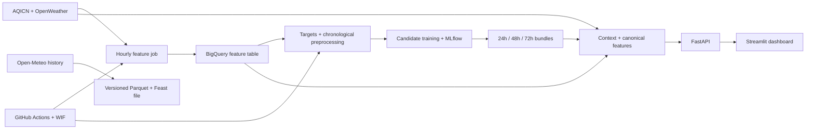
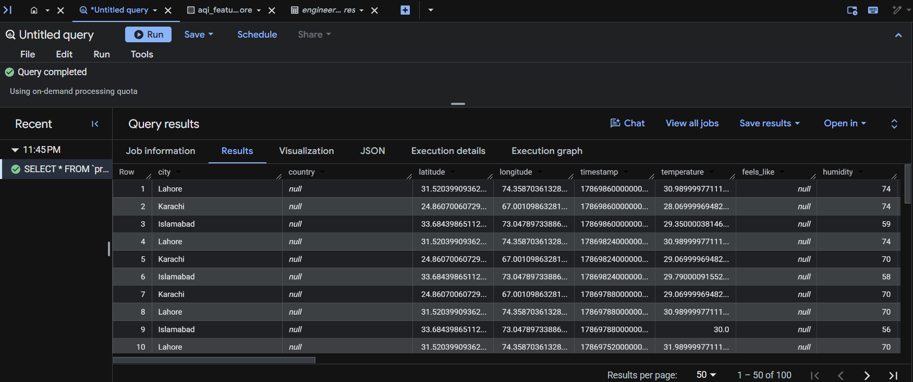
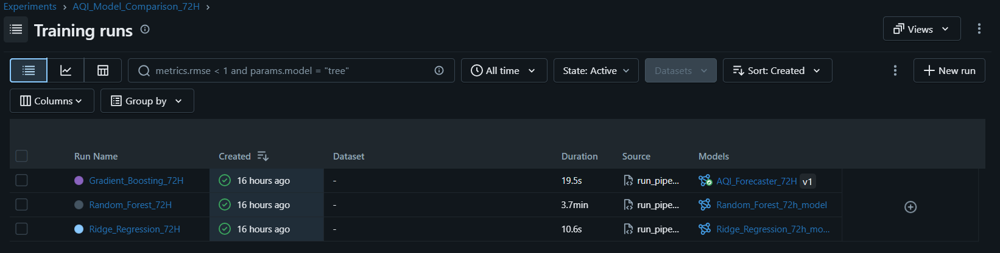
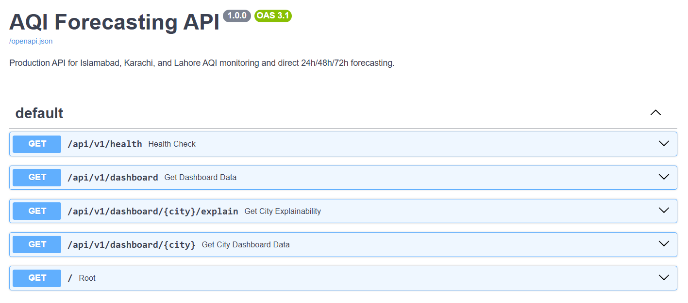
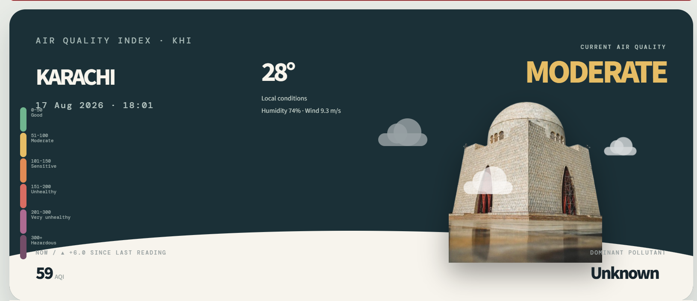
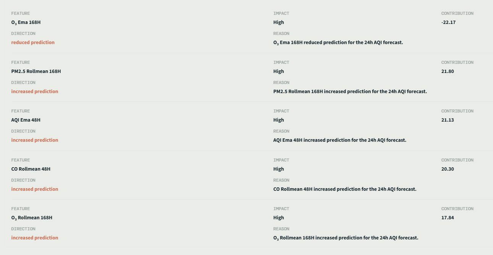
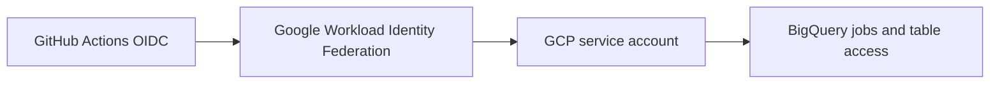

# AQI Forecasting MLOps Platform

This repository collects hourly air-quality and weather observations for Islamabad, Karachi, and Lahore, builds a shared time-series feature pipeline, trains direct 24-, 48-, and 72-hour AQI regressors, and serves the resulting forecasts through FastAPI and Streamlit.

`Python 3.11 · BigQuery · MLflow · FastAPI · Streamlit · GitHub Actions`

## Table of Contents

- [Overview](#overview)
- [Architecture](#architecture)
- [How the Pipeline Works](#how-the-pipeline-works)
- [Feature Engineering](#feature-engineering)
- [Forecasting Strategy](#forecasting-strategy)
- [Model Training and Evaluation](#model-training-and-evaluation)
- [MLflow Tracking](#mlflow-tracking)
- [Prediction and Serving](#prediction-and-serving)
- [Dashboard](#dashboard)
- [Explainability](#explainability)
- [AQI Alerts](#aqi-alerts)
- [Automation](#automation)
- [Cloud Authentication](#cloud-authentication)
- [Project Structure](#project-structure)
- [Running Locally](#running-locally)
- [Configuration](#configuration)
- [Verification](#verification)
- [Current Limitations](#current-limitations)
- [Author](#author)

## Overview

The active system forecasts US AQI for three Pakistani cities:

- Islamabad
- Karachi
- Lahore

Live observations come from AQICN/WAQI and OpenWeather. BigQuery is the scheduled pipeline's historical repository and prediction-context source, with local Parquet as an inference fallback. A separate Open-Meteo backfill path can build local historical datasets without paid historical API access.

The repository includes the operational pieces of an MLOps workflow: scheduled ingestion and training, leakage-aware chronological splits, train-fitted preprocessing, per-horizon model selection, MLflow tracking and registration, horizon-specific model bundles, strict inference schema checks, an API, a dashboard, explainability, and failure notifications.

Checked-in dataset statistics describe 105,054 hourly rows from 2022-07-21 through 2026-07-19, evenly distributed across the three cities. The latest local model metadata records a 606-feature inference contract.

## Architecture



The Open-Meteo/Feast branch is a manual local backfill path. The two scheduled workflows use BigQuery directly.

## How the Pipeline Works

1. **Data ingestion.** The hourly job fetches current AQI and pollutants from AQICN and current weather from OpenWeather. Missing AQICN pollutant values can fall back to OpenWeather's air-pollution endpoint. A city-level failure is logged without stopping attempts for the other cities.
2. **Historical storage.** The active hourly path reads 168 recent rows per city from BigQuery, falls back to local Parquet if needed, and appends only unseen city/hour keys with a BigQuery load job. The separate Open-Meteo backfill writes immutable local Parquet versions and a consolidated Feast-ready file.
3. **Feature engineering.** Batch training, hourly processing, and inference share the ordered feature steps in `src/feature_engineering/pipeline_steps.py`.
4. **Target construction.** Each row is joined to the same city's AQI at exactly +24, +48, and +72 elapsed hours. A missing future timestamp remains an unusable `NaN` label rather than being approximated by the next row.
5. **Training split.** Unique timestamps are divided chronologically into 70% train, 15% validation, and 15% test partitions. The scaler, imputations, category maps, pollution-index bounds, and VIF drops are fitted on training data only.
6. **Model selection.** Ridge, Random Forest, and histogram gradient boosting candidates are ranked by validation RMSE for each horizon. The test partition is evaluated only after a winner is selected.
7. **Model packaging.** Each champion is saved as a model file, JSON metadata, and a Joblib bundle containing the estimator, fitted transformer, ordered feature names, horizon, version, and MLflow run metadata.
8. **Inference.** Recent city history and a latest observation are combined, passed through the canonical feature sequence and bundled transformer, and rejected if their schema differs from the persisted 606-feature contract.
9. **Serving.** FastAPI exposes health, all-city, city-specific, and explanation routes. Streamlit consumes the all-city dashboard endpoint.
10. **Automation.** GitHub Actions authenticates to Google Cloud through OIDC/WIF, runs the hourly feature job and daily training job, validates generated artifacts, and uploads logs and training outputs.

The repository includes a captured BigQuery query result showing hourly rows for the three supported cities:



## Feature Engineering

The canonical order is:

`temporal → lag → rolling → trend → interaction → air quality → spatial → train-fitted scaling/encoding`

| Family | Implemented features |
|---|---|
| Temporal | Calendar fields, cyclical hour/day/month encodings, seasons, weekends, working days, day parts, rush hours, and quarter flags |
| Lag | Per-city AQI lags at 1/3/6/12/24/48/72h; pollutant lags at 1/3/6/24/72h; weather lags at 1/3/6/24h |
| Rolling | Per-city mean, standard deviation, minimum, maximum, median, EMA, and range over 6/12/24/48/168h windows |
| Trend | Per-city differences, percentage changes, rates of change, and momentum for AQI and six pollutants |
| Interaction | Temperature-humidity, wind-PM2.5, PM2.5 per wind, pressure change, dew point, and heat index |
| Air quality | EPA AQI category, pollutant ratios, and a train-normalized weighted pollution index |
| Spatial | Fixed one-hot city schema plus latitude, longitude, and their product; station ID is excluded from production model features |
| Scaling and encoding | Train-fitted median imputation, VIF filtering, categorical encoding, and standard scaling |

The stored training report and all three horizon metadata files agree on **606 ordered model features**.

## Forecasting Strategy

The project uses direct forecasting rather than recursively reusing a 24-hour model:

```text
observation at t ──► model 24h ──► AQI at t + 24h
                 ├─► model 48h ──► AQI at t + 48h
                 └─► model 72h ──► AQI at t + 72h
```

Targets are built with exact same-city timestamp joins. Row offsets are not treated as elapsed hours, so gaps in collection do not silently produce mislabeled targets. Requests return only the direct horizons that exist; they do not interpolate intermediate hourly forecasts.

## Model Training and Evaluation

The scheduled production trainer evaluates these candidates for every horizon:

- `Ridge(alpha=10.0)`
- `RandomForestRegressor(n_estimators=50, max_depth=8)`
- `HistGradientBoostingRegressor(max_iter=100, learning_rate=0.1, max_depth=6)`

The standalone XGBoost, LSTM, Prophet, and ridge-baseline modules are experiments/utilities; they do not participate in the scheduled champion selection path.

The persisted feature build contains 67,055 train, 14,831 validation, and 14,066 test rows after feature warm-up filtering. Horizon-specific loaders then remove rows whose exact future target is unavailable.

The following values come from each champion's held-out **test** metrics in `models/registry/{24,48,72}h_metadata.json`, generated on 2026-08-16. Metrics in each row are from the same split.

| Horizon | Champion | RMSE | MAE | R² |
|---|---|---:|---:|---:|
| 24h | Ridge Regression | 19.1054 | 13.1991 | 0.8146 |
| 48h | Histogram Gradient Boosting | 24.0924 | 16.9506 | 0.7129 |
| 72h | Ridge Regression | 28.8290 | 20.3200 | 0.5874 |

## MLflow Tracking

Training creates one experiment per horizon (`AQI_Model_Comparison_24H`, `48H`, and `72H`). Every candidate logs parameters, train/validation metrics, a model signature, an input example, and its model artifact. The validation winner receives final test metrics, and the trainer attempts to register it as `AQI_Forecaster_{horizon}H` without making a registry failure fatal to local bundle creation.

The daily workflow uses a runner-local SQLite backend and `mlruns/` artifact directory, then uploads both as workflow artifacts. This provides reproducible run evidence but is not a persistent shared MLflow service.



## Prediction and Serving

The production prediction path is:

`historical city context + latest observation → canonical features → persisted transformer → exact schema validation → horizon-specific model`

Prediction context prefers the latest 168 BigQuery rows per city and falls back to `data/training/training_dataset.parquet`. Dashboard requests can enrich the latest row from live APIs. The model loader prefers complete horizon bundles and caches them in memory; legacy model/metadata/scaler files are supported only as a logged fallback.

| Method | Route | Purpose |
|---|---|---|
| GET | `/` | Service metadata and route links |
| GET | `/api/v1/health` | Lightweight process health check; no inference or external calls |
| GET | `/api/v1/dashboard` | Current conditions, direct forecasts, history, and explanations for all cities |
| GET | `/api/v1/dashboard/{city}` | Dashboard payload for one supported city |
| GET | `/api/v1/dashboard/{city}/explain` | Explanation payload for one supported city |
| GET | `/docs` | Generated Swagger UI |

The all-city service isolates failures per city and can return an error object for one city while preserving successful results for the others.



## Dashboard

The Streamlit app calls `/api/v1/dashboard` and displays current AQI/category, local conditions, trend, dominant pollutant, direct 24/48/72-hour forecasts, held-out RMSE labels, pollutant/weather cards, explanation factors, and 24-hour/7-day/30-day history views.

### Karachi



### Lahore


### Islamabad


## Explainability

Dashboard explanations follow the active estimator:

- Linear models use local `transformed feature × fitted coefficient` contributions. The current 24-hour Ridge champion therefore does **not** use SHAP in the dashboard.
- Tree models use TreeSHAP when SHAP is available.
- If TreeSHAP cannot load, tree estimators fall back to global `feature_importances_` and label the result accordingly.
- Explainability errors return an `unavailable` payload and do not invalidate an otherwise successful forecast.

The screenshot below is the real 24-hour dashboard contribution view, despite the historical filename. Separate offline tools in `src/explainability/` support SHAP summary analysis and per-row LIME HTML output. No LIME screenshot is present in the repository.



## AQI Alerts

`EmailAlertService` sends SMTP notifications and converts configuration or delivery failures into a logged `False` result. Both GitHub workflows use it for failure email attempts with `continue-on-error`, so an email problem cannot hide or replace the pipeline failure.

`AQIAlertService` can format a hazardous-forecast email, while the dashboard classifies AQI above 300 as hazardous. The helper is not currently wired into the API/dashboard prediction path, so automatic hazardous-forecast delivery is not active.

## Automation

GitHub cron expressions are evaluated in UTC. Both jobs also support manual `workflow_dispatch` runs.

| Workflow | Trigger | Purpose |
|---|---|---|
| Hourly AQI Feature Pipeline | `17 * * * *` | Fetch three-city live data, rebuild the newest feature rows, deduplicate city/hour keys, and append to BigQuery |
| Daily AQI Training Pipeline | `30 1 * * *` (06:30 PKT) | Read BigQuery history, rebuild targets/features, train all horizons, validate bundles, and upload models, reports, logs, and MLflow state |

### Hourly feature workflow


### Daily training workflow


## Cloud Authentication

Both workflows grant only `contents: read` and `id-token: write`. `google-github-actions/auth@v3` exchanges GitHub's OIDC identity through a configured Workload Identity Provider and impersonates the configured service account; no long-lived GCP key file is stored in the workflow.



## Project Structure

```text
.github/workflows/        Scheduled hourly feature and daily training jobs
src/
├── alerts/               SMTP and AQI alert helpers
├── api/                  FastAPI application, routes, and schemas
├── configs/              Pydantic settings and configuration helpers
├── dashboard/            Streamlit application and UI components
├── dataset_pipeline/     Local historical dataset assembly and quality reports
├── explainability/       Dashboard explanations plus offline SHAP/LIME tools
├── feature_engineering/  Canonical time-series feature families and ordering
├── feature_pipeline/     Scheduled hourly feature job
├── feature_store/        BigQuery read, context, idempotency, and append adapter
├── ingestion/            Live clients, validation, storage, and Open-Meteo backfill
├── prediction/           Context loading, feature preparation, inference, and dashboard service
└── training/             Target construction, splits, model selection, bundles, and evaluation
feature_repo/             Local Feast file-source prototype; not the scheduled store
data/                     Local raw, processed, training, and prediction artifacts
models/registry/          Generated horizon models, metadata, and bundles
reports/                  EDA statistics and plots
docs/images/              Verified README screenshots
tests/                    Unit, integration-style, and BigQuery contract tests
```

## Running Locally

Use Python 3.11, matching both GitHub workflows and `requirements.txt`.

### 1. Create an environment and install dependencies

```bash
python -m venv .venv
python -m pip install --upgrade pip
python -m pip install -r requirements.txt
```

Activate `.venv` using the command appropriate for your shell before installing. The root `.env.example` is currently incomplete and uses names that do not match the active nested settings model; use the verified names in [Configuration](#configuration) when creating `.env`.

BigQuery-backed commands also require Google Application Default Credentials with access to the configured project, dataset, and table.

### 2. Run the hourly feature pipeline

Validate feature generation without appending rows:

```bash
python -m src.feature_pipeline.run_pipeline --dry-run
```

Run the append path:

```bash
python -m src.feature_pipeline.run_pipeline
```

Both commands still call the live APIs and inspect the target BigQuery schema.

### 3. Run training

```bash
python -m src.training.run_pipeline
```

This reads the complete configured BigQuery table, writes runtime datasets under `data/training/`, and creates per-horizon artifacts under `models/registry/`.

### 4. Run prediction

Generate all available direct horizons through a 72-hour request:

```bash
python main.py forecast --hours 72
```

Or predict from a JSON payload containing at least `timestamp`, `city`, `latitude`, and `longitude`:

```bash
python main.py predict payload.json --horizon 24
```

### 5. Run FastAPI and Streamlit

Start the API:

```bash
python -m uvicorn src.api.app:app --reload
```

In a second shell, start the dashboard:

```bash
python -m streamlit run src/dashboard/streamlit_app.py
```

The defaults are `http://127.0.0.1:8000` for FastAPI, `/docs` for Swagger, and port 8501 for Streamlit.

### 6. Inspect local MLflow state

If `mlflow.db` and `mlruns/` have been generated or downloaded from a workflow artifact:

```bash
python -m mlflow ui --backend-store-uri sqlite:///mlflow.db --default-artifact-root ./mlruns
```

## Configuration

Store secrets outside version control. These names are read by source code or the active workflows:

| Group | Variables |
|---|---|
| APIs | `AQICN_API_KEY`, `OPENWEATHER_API_KEY` |
| BigQuery | `GCP_PROJECT_ID`, `BIGQUERY_DATASET_ID`, `BIGQUERY_FEATURE_TABLE`, `BIGQUERY_LOCATION` |
| MLflow | `MLFLOW_TRACKING_URI`, `MLFLOW_ARTIFACT_ROOT` |
| GCP/WIF GitHub secrets | `GCP_PROJECT_ID`, `GCP_WORKLOAD_IDENTITY_PROVIDER`, `GCP_SERVICE_ACCOUNT` |
| Email/alerts | `ALERT_SMTP_HOST`, `ALERT_SMTP_PORT`, `ALERT_SMTP_USE_TLS`, `ALERT_SMTP_USERNAME`, `ALERT_SMTP_PASSWORD`, `ALERT_FROM_EMAIL`, `ALERT_TO_EMAILS` |
| Application | `APP_ENV`, `LOCATION__CITY`, `LOCATION__COUNTRY`, `PATHS__RAW_DATA`, `PATHS__PROCESSED_DATA`, `PATHS__MODELS`, `PATHS__REPORTS`, `PATHS__LOGS` |
| API/dashboard | `API_BASE_URL`, `DASHBOARD_USE_LIVE_API`, `DASHBOARD_USE_BIGQUERY`, `CORS_ALLOWED_ORIGINS`, `CORS_ALLOW_CREDENTIALS` |

When not overridden, the BigQuery adapter uses dataset `aqi_feature_store`, table `engineered_features`, and location `asia-south1`; `GCP_PROJECT_ID` has no default.

## Verification

This README was reconciled against the active source code, both GitHub Actions workflows, checked-in dataset reports, local 2026-08-16 model metadata, MLflow state, tests, and every referenced image. All Markdown image paths exist with the exact capitalization shown and use repository-relative `/` separators.

Implemented and evidenced in the repository:

- Three-city live collection, BigQuery context/append code, exact-time target construction, canonical feature engineering, model selection, bundles, prediction, FastAPI, Streamlit, explainability fallbacks, and SMTP failure notifications.
- Scheduled workflow definitions plus repository screenshots of successful hourly and daily runs.
- Stored held-out test metrics for all three direct horizons.

Not verified during this documentation pass:

- Current external API responses, current BigQuery contents/permissions, or a fresh GitHub Actions execution.
- The local pytest suite, because the shell's `python` command points to an inaccessible system interpreter, the Python launcher reports no installed Python 3.11, and the available bundled interpreter does not include pytest. The repository contains 23 test files, but the workflows do not currently run them as a dedicated test gate.

## Current Limitations

- `models/`, `mlflow.db`, `mlruns/`, and generated feature splits are gitignored. A fresh clone cannot serve forecasts until bundles are trained or downloaded from the daily workflow artifact, whose retention is 30 days.
- MLflow uses runner-local SQLite and filesystem artifacts; there is no durable shared tracking server or long-lived model registry.
- Daily training performs an ordered full-table BigQuery read. Dataset growth will require partition-aware selection or incremental training snapshots.
- BigQuery currently serves as both the hourly feature table and the source that training reprocesses. A clearer raw-observation/derived-feature boundary would reduce semantic drift risk.
- The API has CORS configuration but no authentication, rate limiting, deployment workflow, or persistent drift/serving monitor.
- Hazardous AQI email formatting exists, but prediction-triggered alert dispatch is not connected.
- The local Feast and Hopsworks-oriented code is outside the scheduled production path; Feast is not declared in `requirements.txt`, and the Hopsworks upload path expects settings that the active `Settings` model does not define.
- Dependencies are mostly unpinned, `.env.example` is not an accurate runtime template, the root contains zero-byte command-like files including `python`, and `LICENSE` is not a recognized open-source license text.

## Author

Syed Abdullah Bin Masood

Data Science Intern, 10Pearls


