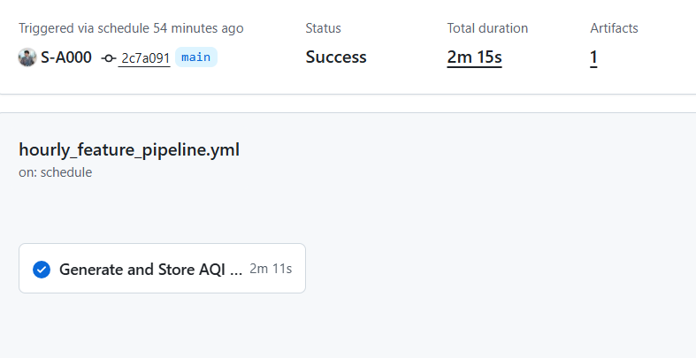
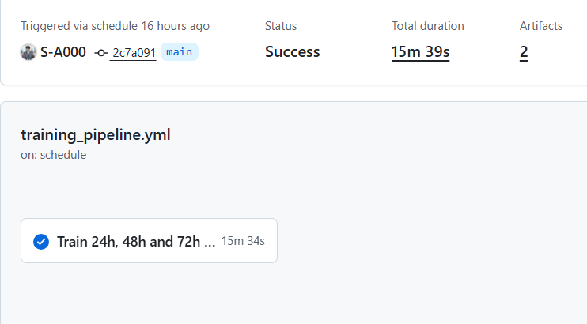

AQI Forecasting MLOps Platform

Production-oriented multi-horizon Air Quality Index (AQI) forecasting for Islamabad, Karachi, and Lahore.

Organization: 10Pearls
Author: Syed Abdullah Bin Masood
Role: Data Science Intern
Supervisor: Umema Ashar
Forecast horizons: 24h, 48h, 72h
Primary stack: Python, BigQuery, MLflow, GitHub Actions, FastAPI, Streamlit

This repository contains the end-to-end data, training, inference, automation, explainability, and dashboard workflow used for the AQI forecasting project.

Table of Contents

Project Overview

Project Objectives

Current Implementation Status

System Architecture

Data Lineage

Data Ingestion and Validation

Cloud Feature Repository

Feature Engineering

Forecast Targets and Dataset Preparation

Model Development and MLflow

Model Evaluation

Model Packaging

Inference and API Serving

Streamlit Dashboard

Explainability

Hazardous AQI Alerts

Workflow Automation

Cloud Authentication

Security and Reliability

Observability

Verification Evidence

Repository Structure

Common Commands

Production Hardening

Notes on Serverless Scope

References

Project Overview

AQI forecasting is a time-dependent regression problem. Future air quality depends on recent pollutant behavior, weather conditions, temporal patterns, and city-specific context.

The project was built as an MLOps system rather than as a standalone notebook or a single trained model. It covers the full path from external observations to a served forecast:

External APIs
    -> validation
    -> historical storage
    -> feature engineering
    -> training dataset
    -> model comparison
    -> model bundle
    -> inference
    -> FastAPI
    -> Streamlit

The current implementation produces three direct forecasts:

AQI after 24 hours

AQI after 48 hours

AQI after 72 hours

The models do not generate a fake hourly sequence by repeating one prediction. Each horizon is trained and served independently.

Project Objectives

The implementation covers the following engineering goals.

Data operations

Collect AQI and pollutant observations from AQICN / WAQI.

Collect weather context from OpenWeather.

Validate and normalize external payloads.

Maintain city-aware historical data.

Append only new logical city/hour records to BigQuery.

Feature operations

Build one canonical feature pipeline.

Reuse the same feature logic in training and inference.

Create temporal, lag, rolling, trend, interaction, air-quality, and spatial features.

Fit preprocessing statistics on training data only.

Keep a strict ordered serving schema.

Model operations

Create exact elapsed-time targets for 24h, 48h, and 72h.

Use chronological train/validation/test splits.

Compare multiple regression models.

Select the champion using validation RMSE.

Report held-out test performance only after model selection.

Track experiments in MLflow.

Package the estimator, fitted transformer, metadata, and ordered schema together.

Serving and automation

Run feature ingestion hourly.

Run model training daily.

Serve forecasts through FastAPI.

Present results through Streamlit.

Provide SHAP/LIME-based explanation paths.

Send hazardous-AQI notifications.

Authenticate GitHub Actions to Google Cloud using OIDC and Workload Identity Federation.

Current Implementation Status

Component

Status

AQICN / WAQI ingestion

Complete

OpenWeather ingestion

Complete

BigQuery historical repository

Complete

Canonical feature pipeline

Complete

24h / 48h / 72h direct targets

Complete

Chronological train/validation/test preparation

Complete

Multi-model comparison

Complete

RMSE / MAE / R² evaluation

Complete

MLflow tracking

Complete

Production model bundles

Complete

FastAPI serving

Complete

Streamlit dashboard

Complete

SHAP / model-contribution explanation

Complete

LIME explanation

Complete

Hazardous AQI alert path

Complete

Hourly GitHub Actions workflow

Verified

Daily GitHub Actions workflow

Verified

Google Workload Identity Federation

Complete

System Architecture

flowchart TB
    subgraph DATA["Hourly data pipeline"]
        AQICN["AQICN / WAQI AQI + pollutants"]
        WEATHER["OpenWeather weather context"]
        LIVE["Live Data Service"]
        VALIDATE["Validation and canonicalization"]
        FEATURES["Canonical feature engineering"]
        BQ["BigQuery historical repository"]

        AQICN --> LIVE
        WEATHER --> LIVE
        LIVE --> VALIDATE
        VALIDATE --> FEATURES
        FEATURES --> BQ
    end

    subgraph TRAIN["Daily model lifecycle"]
        SNAPSHOT["BigQuery training snapshot"]
        PIPELINE["Daily training pipeline"]
        CANDIDATES["Ridge / Random Forest / HistGradientBoosting"]
        SELECT["Validation selection + MLflow tracking"]
        BUNDLE["Production model bundle + metadata"]

        SNAPSHOT --> PIPELINE
        PIPELINE --> CANDIDATES
        CANDIDATES --> SELECT
        SELECT --> BUNDLE
    end

    subgraph SERVING["Serving and user experience"]
        INPUTS["Live observation + historical context + bundle"]
        INFERENCE["Strict multi-horizon inference pipeline"]
        API["FastAPI dashboard service"]
        UI["Streamlit dashboard"]
        ALERT["Hazardous AQI alerts"]

        INPUTS --> INFERENCE
        INFERENCE --> API
        API --> UI
        API --> ALERT
    end

    subgraph AUTOMATION["Automation and cloud identity"]
        ACTIONS["GitHub Actions"]
        RUNNER["GitHub-hosted Python runner"]
        WIF["OIDC + Google WIF"]
        SA["Service-account impersonation"]
        CLOUD["Authorized Google Cloud resources"]

        ACTIONS --> RUNNER
        RUNNER --> WIF
        WIF --> SA
        SA --> CLOUD
    end

    BQ --> SNAPSHOT
    BQ --> INPUTS
    BUNDLE --> INPUTS

Main responsibility boundaries

Data plane
AQICN and OpenWeather provide external observations. BigQuery maintains historical city context.

Feature plane
A single ordered pipeline transforms raw observations into the model representation.

Model plane
The training path prepares chronological datasets, builds direct targets, trains candidate models, tracks experiments, selects champions, and creates model bundles.

Serving plane
The predictor loads the fitted transformer and validates the exact feature order before calling a horizon-specific model.

Experience plane
FastAPI exposes the service contract and Streamlit displays current AQI, history, forecasts, evaluation information, and explanation output.

Automation plane
GitHub Actions runs the data and model pipelines and authenticates to Google Cloud without a static service-account key.

Data Lineage

flowchart LR
    A["External API payloads"]
    B["Validated observations"]
    C["Canonical city/hour records"]
    D["BigQuery history"]
    E["Canonical feature build"]
    F["Chronological train / validation / test"]
    G["Champion model bundle"]
    H["24h / 48h / 72h forecast"]

    A --> B --> C --> D --> E --> F --> G --> H

The same feature semantics are maintained from training through serving. This is important because a good validation score is not useful if inference constructs a different feature representation.

Data Ingestion and Validation

AQICN / WAQI

Used for the current air-quality signal.

Representative fields:

AQI

PM2.5

PM10

NO₂

SO₂

CO

O₃

dominant pollutant

station information

Coverage:

Islamabad

Karachi

Lahore

OpenWeather

Used for meteorological context.

Representative fields:

temperature

feels-like temperature

humidity

pressure

visibility

wind speed

wind direction

cloudiness

Weather collection can be disabled without removing the AQI ingestion path.

Reliability controls

The ingestion layer includes:

request timeouts

request rate control

retry with exponential backoff

provider authentication

structured logging

request correlation

circuit-breaker behavior

payload validation

flowchart LR
    A["External request"]
    B["Timeout / rate control"]
    C["Retry / backoff"]
    D["Schema validation"]
    E["Canonical payload"]
    F["Failure log / alert"]

    A --> B --> C --> D --> E
    C -. failure .-> F

Serving payload contract

Required fields:

city
timestamp
latitude
longitude

Weather and pollutant measurements remain optional when unavailable.

Wind aliases are normalized to:

wind_degree

Missing optional values are handled through the persisted training-time preprocessing contract. They are not replaced with arbitrary environmental constants just to keep inference running.

Cloud Feature Repository

BigQuery is used as the cloud historical repository for this implementation.

Configuration

Setting

Value

Dataset

aqi_feature_store

Table

engineered_features

Region

asia-south1

Physical columns

31

Write mode

WRITE_APPEND

Logical key

normalized city + canonical event hour

The Google Cloud project is configured through the runtime environment rather than being treated as application logic.

Schema groups

Identity and provenance

city
country
latitude
longitude
timestamp
station_id
source
created_at

Meteorological context

temperature
feels_like
humidity
pressure
visibility
wind_speed
wind_degree
cloudiness

Air-quality signals

aqi
dominant_pollutant
pm25
pm10
no2
so2
co
o3

Compact derived fields stored in BigQuery

hour
day
month
day_of_week
is_weekend
aqi_change_rate
aqi_rolling_mean_3h

Idempotent hourly append

The hourly writer:

normalizes each incoming record to its event hour;

removes duplicate keys inside the incoming batch;

reads existing keys for the relevant time range;

removes already stored city/hour records;

appends only new rows.

flowchart LR
    A["New three-city hourly batch"]
    B["Normalize event hour"]
    C["Within-batch dedupe"]
    D["Existing-key lookup"]
    E["Keep new logical keys"]
    F["BigQuery WRITE_APPEND"]

    A --> B --> C --> D --> E --> F

BigQuery evidence

Feature Engineering

The production feature pipeline follows one canonical order.

flowchart LR
    A["Temporal"]
    B["Lag"]
    C["Rolling"]
    D["Trend"]
    E["Interaction"]
    F["Air quality"]
    G["Spatial"]
    H["Scaling / encoding"]

    A --> B --> C --> D --> E --> F --> G --> H

Feature families

Feature family

Intermediate additions

Purpose

Temporal

41

calendar, cyclic time, seasonal/weekend and time-of-day signals

Lag

53

past AQI, pollutant and weather observations

Rolling

385

rolling mean, spread, median, range, EMA and other window statistics

Trend

91

local direction, momentum, slope and change-rate features

Interaction

6

pollutant/weather and related contextual interactions

Air quality

6

pollution-index and AQ-derived transformations

Spatial

4

fixed city representation for Islamabad, Karachi and Lahore

Production feature contract

The final serving schema contains:

606 ordered model features
594 scaled numerical features

The fitted preprocessing object is reused at inference time.

Leakage and parity controls

Transformations that learn statistics are fitted on the training split and reused for validation, test, and inference.

This includes:

imputation statistics

scaling parameters

categorical alignment

pollutant normalization

final feature ordering

Backward filling from future observations is not used in the production preprocessing path.

Forecast Targets and Dataset Preparation

Direct elapsed-time targets

The project creates three independent targets:

target_24h = AQI(city, timestamp + 24 hours)
target_48h = AQI(city, timestamp + 48 hours)
target_72h = AQI(city, timestamp + 72 hours)

Targets are joined by city and exact timestamp.

A fixed row shift is not assumed to represent a fixed number of hours.

flowchart LR
    T["Input at time t"]
    H24["AQI at t + 24h"]
    H48["AQI at t + 48h"]
    H72["AQI at t + 72h"]

    T --> H24
    T --> H48
    T --> H72

Chronological dataset split

Split

Rows

Purpose

Training

66,549

fit estimators and learned preprocessing statistics

Validation

14,767

compare candidate models and select the champion

Held-out test

14,660

final evaluation after champion selection

The split is chronological rather than random to reduce temporal leakage.

Model Development and MLflow

Active candidate models

Ridge Regression

L2-regularized linear baseline.

Current role:

selected champion for 24h

selected champion for 72h

Random Forest

Non-linear ensemble baseline.

Current configuration includes:

n_estimators = 50
max_depth = 8

HistGradientBoosting

Histogram-based gradient boosting.

Current configuration includes:

max_iter = 100
learning_rate = 0.1
max_depth = 6

Current role:

selected champion for 48h

Standalone XGBoost, LSTM, Prophet, and Ridge-baseline scripts are kept as separate experimentation paths. The scheduled champion-selection pipeline uses Ridge, Random Forest, and HistGradientBoosting under one common evaluation contract.

Champion selection

Candidate models are compared using validation RMSE.

The held-out test split is not used to choose the winner.

flowchart LR
    A["Prepared training split"]
    B["Candidate models"]
    C["Validation RMSE comparison"]
    D["Champion selection"]
    E["Held-out test metrics"]
    F["MLflow tracking"]
    G["Production model bundle"]

    A --> B --> C --> D --> E --> F --> G

MLflow tracking

Each horizon-specific run records model information such as:

parameters
train metrics
validation metrics
test metrics
horizon
model identity
model artifact
training timestamp
run ID

MLflow evidence

Model Evaluation

The project tracks three standard regression metrics.

RMSE

RMSE = sqrt(mean((actual - predicted)^2))

RMSE gives larger errors more weight.

MAE

MAE = mean(abs(actual - predicted))

MAE is directly interpretable in AQI units.

R²

R² = 1 - residual_sum_of_squares / total_sum_of_squares

Higher R² indicates more explained variation.

Latest verified champions

Horizon

Champion

Held-out RMSE

R²

24h

Ridge Regression

19.1054

0.8146

48h

HistGradientBoosting

24.0924

0.7129

72h

Ridge Regression

28.8290

0.5874

MAE is logged per training/validation/test run in MLflow. The README intentionally avoids mixing a training MAE with held-out RMSE/R² values.

Example inference output

A verified inference run produced:

Horizon

Predicted AQI

Model

+24h

73.23

Ridge Regression

+48h

115.24

HistGradientBoosting

+72h

62.11

Ridge Regression

Longer horizons show higher held-out error, which is expected for a harder forecasting problem.

Model Packaging

Each production model bundle contains:

estimator

fitted preprocessing transformer

ordered feature names

forecast horizon

model name and version

validation information

held-out test metrics

training metadata

flowchart TB
    A["Production model bundle"]
    B["Estimator"]
    C["Fitted transformer"]
    D["Ordered feature schema"]
    E["Version / horizon / metrics / metadata"]

    A --> B
    A --> C
    A --> D
    A --> E

The bundle prevents a common serving problem: loading a model without the preprocessing state and feature order used during training.

Representative metadata:

metadata = {
    "model_version": "1.0.0",
    "algorithm": model_name,
    "horizon_hours": horizon_hours,
    "feature_names": splits.feature_names,
    "feature_count": len(splits.feature_names),
    "selection_metric": "validation_rmse",
    "train_metrics": train_metrics,
    "validation_metrics": validation_metrics,
    "test_metrics": test_metrics,
    "best_test_rmse": round(test_metrics["rmse"], 4),
    "mlflow_run_id": run_id,
    "training_timestamp": training_timestamp,
}

Inference and API Serving

The prediction path uses real recent city context and the latest available observation.

flowchart LR
    A["Recent same-city context"]
    B["Latest live AQI / weather"]
    C["Merge + validate"]
    D["Canonical features"]
    E["Persisted transformer"]
    F["Strict 606-feature contract"]
    G["24h / 48h / 72h model bundle"]
    H["Forecast response"]

    A --> C
    B --> C
    C --> D --> E --> F --> G --> H

The predictor rejects feature-contract mismatches rather than silently inserting missing model features.

FastAPI endpoints

Method

Endpoint

Purpose

GET

/

service information

GET

/api/v1/health

lightweight health check

GET

/api/v1/dashboard

all-city dashboard payload

GET

/api/v1/dashboard/{city}

one-city dashboard payload

GET

/api/v1/dashboard/{city}/explain

explanation response

API evidence

Streamlit Dashboard

The frontend is an operational AQI view rather than a model-debug interface.

It presents:

selected city

current AQI

AQI category

weather context

dominant pollutant

historical AQI trend

24h forecast

48h forecast

72h forecast

model evaluation information

explanation factors

Unavailable environmental values are displayed as unavailable rather than as fabricated zeroes.

RMSE is shown as model evaluation information, not as probabilistic confidence.

Karachi

Lahore

Islamabad

Explainability

Explainability is kept separate from the core prediction path so an explanation failure does not invalidate the forecast.

Linear / Ridge models

For linear models, local contribution can be computed from the transformed feature value and learned coefficient.

Tree models

Compatible tree models can use SHAP TreeExplainer.

If SHAP is unavailable for a supported tree model, model-native feature importance can be used as a controlled fallback.

LIME

LIME is available for local explanations around a selected observation.

SHAP / model-contribution evidence

LIME evidence

Hazardous AQI Alerts

The alert layer evaluates AQI conditions and can send an email notification when the configured hazardous condition is met.

flowchart LR
    A["Current / forecast AQI"]
    B["AQI category evaluation"]
    C{"Hazardous condition?"}
    D["SMTP email notification"]
    E["Normal dashboard response"]

    A --> B --> C
    C -- Yes --> D
    C -- No --> E

SMTP credentials are supplied through runtime configuration / GitHub secrets.

Alert delivery is decoupled from forecasting. A notification failure does not alter the prediction result.

Workflow Automation

Hourly feature pipeline

GitHub Actions schedule:

schedule:
  - cron: "17 * * * *"

Main responsibilities:

authenticate to Google Cloud

fetch live observations

validate and canonicalize data

build hourly output

align data with the BigQuery schema

append only new city/hour records

retain diagnostic logs

attempt failure notification when required

Daily training pipeline

GitHub Actions schedule:

schedule:
  - cron: "30 1 * * *"

This is approximately 06:30 PKT.

Main responsibilities:

synchronize historical training data

rebuild leakage-aware features

create exact 24h / 48h / 72h targets

train candidate models

select each champion using validation RMSE

evaluate the selected model on held-out test data

persist model and MLflow artifacts

Workflow evidence

Hourly feature pipeline

Daily training pipeline

Cloud Authentication

The workflows use GitHub OIDC and Google Workload Identity Federation.

flowchart LR
    A["GitHub Actions runner"]
    B["GitHub OIDC token"]
    C["Google Workload Identity Provider"]
    D["Service-account impersonation"]
    E["BigQuery / authorized GCP resources"]

    A --> B --> C --> D --> E

This removes the need to store a long-lived Google service-account private key in the repository.

Security and Reliability

Secret management

Sensitive values are provided through the environment or GitHub secrets.

Examples include:

AQICN credentials

OpenWeather credentials

BigQuery configuration

Workload Identity configuration

SMTP credentials

Credentials should not be committed to Git.

Cloud access

The automation identity is limited to the permissions required by the workflow, including:

create BigQuery jobs

read permitted table data and metadata

append permitted data

create a BigQuery Storage API read session when used

impersonate the configured service account through WIF

Serving safety

The API includes:

city validation

restricted CORS behavior

lazy service initialization

service-level prediction errors

strict feature validation

Missing environmental inputs are not replaced with arbitrary constants solely to produce a response.

Observability

The project includes the foundations for runtime observability.

Structured logging

Request and pipeline logs capture:

lifecycle stage

failure information

execution duration

request/correlation context

Metrics

Prometheus metric primitives are used for reliability-oriented runtime measurements such as:

request counts

request duration

operational failures

Tracing

OpenTelemetry instrumentation provides a base for tracing HTTP/API operations.

Failure isolation

The system follows these rules:

explainability failure does not invalidate the forecast;

email failure does not change the prediction;

one-city failure does not necessarily remove all city results;

missing optional fields are not replaced with arbitrary constants;

feature-contract mismatches are rejected.

Verification Evidence

The following paths have been verified during the project:

Area

Verification

Hourly data pipeline

authentication, ingestion, feature processing, BigQuery interaction, scheduled execution

Daily training pipeline

scheduled training and artifact generation

Explainability

SHAP/model contribution and LIME execution

Serving

FastAPI dashboard response and direct 24h/48h/72h prediction path

BigQuery

MLflow

FastAPI

GitHub Actions

  
  

Repository Structure

src/
├── api/
│   ├── app.py
│   ├── routes.py
│   └── schemas.py
│
├── alerts/
│   ├── aqi_alert_service.py
│   └── email_alert_service.py
│
├── configs/
│   └── settings.py
│
├── dashboard/
│   ├── streamlit_app.py
│   └── components.py
│
├── explainability/
│   ├── dashboard_explainer.py
│   ├── shap_analysis.py
│   └── lime_analysis.py
│
├── feature_engineering/
│   ├── pipeline_steps.py
│   ├── temporal_features.py
│   ├── lag_features.py
│   ├── rolling_features.py
│   ├── trend_features.py
│   ├── interaction_features.py
│   ├── air_quality_features.py
│   ├── spatial_features.py
│   ├── scaling_encoding.py
│   └── build_features.py
│
├── feature_pipeline/
│   └── run_pipeline.py
│
├── feature_store/
│   └── bigquery_feature_store.py
│
├── prediction/
│   ├── dashboard_service.py
│   ├── feature_pipeline.py
│   ├── forecast.py
│   ├── live_data_service.py
│   ├── load_features.py
│   ├── load_model.py
│   ├── predictor.py
│   └── validator.py
│
└── training/
    ├── forecast_targets.py
    ├── dataset.py
    ├── model_bundle.py
    ├── train_multi_models.py
    └── run_pipeline.py

.github/
└── workflows/
    ├── hourly_feature_pipeline.yml
    └── training_pipeline.yml

models/
└── registry/

data/
├── training/
└── predictions/

docs/
└── images/
    ├── tenpearls_logo.png
    ├── dashboard_karachi.png
    ├── dashboard_lahore.png
    ├── dashboard_islamabad.png
    ├── mlflow_runs.png
    ├── shap_summary.png
    ├── lime_explanation.png
    ├── github_hourly_green.png
    ├── github_daily_green.png
    ├── bigquery_table.png
    └── api_docs.png

Common Commands

Run commands from the repository root.

Activate the local virtual environment on Windows

.venv\Scripts\activate

Run the FastAPI backend

python -m uvicorn src.api.app:app --reload --host 127.0.0.1 --port 8000

Swagger:

http://127.0.0.1:8000/docs

Run the Streamlit dashboard

streamlit run src/dashboard/streamlit_app.py

Run the hourly feature pipeline manually

python -m src.feature_pipeline.run_pipeline

Run the training pipeline manually

python -m src.training.run_pipeline

Run direct multi-horizon forecasting

python -m src.prediction.forecast

The scheduled GitHub workflows run independently of the local machine.

Image Files Used by This README

Create this folder in the repository:

docs/images/

Place the following files inside it:

docs/images/tenpearls_logo.png
docs/images/mlflow_runs.png
docs/images/api_docs.png
docs/images/dashboard_karachi.png
docs/images/dashboard_lahore.png
docs/images/dashboard_islamabad.png
docs/images/shap_summary.png
docs/images/lime_explanation.png
docs/images/github_hourly_green.png
docs/images/github_daily_green.png
docs/images/bigquery_table.png

The README already points to these paths. Once the images are committed, GitHub will render them automatically.

Production Hardening

The current project covers the required functional MLOps lifecycle. The following are future hardening items rather than core missing features.

Reproducible environments

pin and lock dependencies;

separate lightweight runtime environments for ingestion, training, API, and dashboard workloads.

CI quality gates

deterministic unit tests;

schema-contract tests;

leakage checks;

linting;

typing;

secret scanning;

integration checks before deployment.

BigQuery efficiency

bounded training queries;

partition-aware reads;

explicit cost controls as the historical dataset grows.

Serving scalability

deployment-specific caching;

request budgets;

rate limiting;

readiness checks;

autoscaling where required.

Monitoring and drift

persistent metrics/tracing backend;

feature-distribution monitoring;

missingness monitoring;

prediction residual monitoring;

drift detection.

Model governance

stronger promotion and rollback controls;

artifact-integrity checks;

environment separation;

release ownership metadata.

Notes on Serverless Scope

The data and ML automation plane does not depend on the developer's laptop:

GitHub-hosted runners execute scheduled workflows;

BigQuery stores cloud historical data;

GitHub OIDC and Google Workload Identity Federation provide cloud authentication.

FastAPI and Streamlit are kept separate from the data/training automation plane and can be deployed to the runtime selected for the project.

This distinction is intentional: the repository does not claim that a locally running FastAPI or Streamlit process is itself a serverless deployment.

Technical Notes

Why BigQuery is used

For this implementation, BigQuery acts as the cloud historical / feature repository shared by ingestion, training, and prediction context.

Why exact elapsed-time targets are used

A row shift is only equivalent to 24 hours when every expected hourly observation exists. Matching by city and timestamp keeps target semantics correct when observations are missing.

Why preprocessing is packaged with the model

The estimator expects the exact transformed representation used during training. Keeping the fitted transformer and ordered schema with the model reduces training-serving skew.

Why champion selection uses validation RMSE

The held-out test split is reserved for final evaluation. Using test performance to choose the model would leak evaluation information into model selection.

Why three separate horizons are served

24h, 48h, and 72h represent different forecasting problems. Separate horizon models preserve those semantics and avoid presenting repeated values as a false hourly forecast.

References

The explainability implementation follows the ideas introduced in:

Scott M. Lundberg and Su-In Lee, A Unified Approach to Interpreting Model Predictions, NeurIPS, 2017.

Marco Tulio Ribeiro, Sameer Singh, and Carlos Guestrin, "Why Should I Trust You?": Explaining the Predictions of Any Classifier, KDD, 2016.

Author

Syed Abdullah Bin Masood
Data Science Intern, 10Pearls
