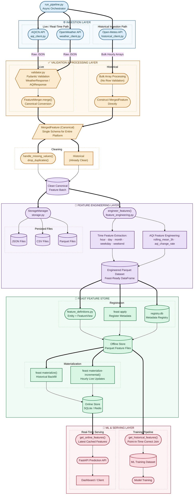

```mermaid
%%{init: {"flowchart": {"curve": "basis", "htmlLabels": true}, "theme": "base"} }%%
flowchart TD

    orchestrator(["run_pipeline.py<br/>Async Orchestrator"]):::ingestion

    %% ==================== INGESTION LAYER ====================
    subgraph ING["🌐 INGESTION LAYER"]
        direction LR
        subgraph LIVE["Live / Real-Time Path"]
            direction TB
            aqi(["AQICN API<br/>aqi_client.py"]):::ingestion
            weather(["OpenWeather API<br/>weather_client.py"]):::ingestion
        end
        subgraph HIST["Historical Ingestion Path"]
            direction TB
            openmeteo(["Open-Meteo API<br/>historical_client.py"]):::ingestion
        end
    end

    orchestrator ==> aqi
    orchestrator ==> weather
    orchestrator ==> openmeteo

    %% ==================== VALIDATION & PROCESSING LAYER ====================
    subgraph VAL["✅ VALIDATION & PROCESSING LAYER"]
        direction LR
        subgraph VALLIVE["Live"]
            direction TB
            validator{{"validator.py<br/>Pydantic Validation<br/>WeatherResponse / AQIResponse"}}:::processing
            merger(["FeatureMerger.merge()<br/>Canonical Conversion"]):::processing
        end
        subgraph VALHIST["Historical"]
            direction TB
            bulk(["Bulk Array Processing<br/>(No Row Validation)"]):::processing
            construct(["Construct MergedFeature<br/>Directly"]):::processing
        end
    end

    aqi ==>|"Raw JSON"| validator
    weather ==>|"Raw JSON"| validator
    validator --> merger
    openmeteo ==>|"Bulk Hourly Arrays"| bulk
    bulk --> construct

    canonical[/"MergedFeature (Canonical)<br/>Single Schema for Entire Platform"/]:::processing
    merger ==> canonical
    construct ==> canonical

    subgraph CLEAN["Cleaning"]
        direction LR
        liveclean(["handle_missing_values()<br/>drop_duplicates()"]):::processing
        histclean["Historical<br/>(Already Clean)"]:::processing
    end

    canonical ==> liveclean
    canonical ==> histclean

    cleanbatch[("Clean Canonical<br/>Feature Batch")]:::storage
    liveclean --> cleanbatch
    histclean --> cleanbatch

    %% ==================== FEATURE ENGINEERING LAYER ====================
    subgraph FE["🧬 FEATURE ENGINEERING LAYER"]
        direction LR
        storagemgr(["StorageManager<br/>storage.py"]):::storage
        subgraph FILES["Persisted Files"]
            direction TB
            json[("JSON Files")]:::storage
            csv[("CSV Files")]:::storage
            parquet[("Parquet Files")]:::storage
        end
        engineer(["engineer_features()<br/>feature_engineering.py"]):::storage
        timefeat["Time Feature Extraction:<br/>hour · day · month · weekday · weekend"]:::storage
        aqifeat["AQI Feature Engineering:<br/>rolling_mean_3h · aqi_change_rate"]:::storage
        readyparquet[("Engineered Parquet Dataset<br/>Feast-Ready DataFrame")]:::storage
    end

    cleanbatch ==> storagemgr
    cleanbatch ==> engineer
    storagemgr --> json
    storagemgr --> csv
    storagemgr --> parquet
    engineer --> timefeat
    engineer --> aqifeat
    timefeat --> readyparquet
    aqifeat --> readyparquet

    %% ==================== FEAST FEATURE STORE ====================
    subgraph FEAST["🍃 FEAST FEATURE STORE"]
        direction TB
        subgraph REG["Registration"]
            direction LR
            featuredefs(["feature_definitions.py<br/>Entity + FeatureView"]):::feast
            applyfeast["feast apply<br/>Register Metadata"]:::feast
            registry[("registry.db<br/>Metadata Registry")]:::feast
        end
        offline[("Offline Store<br/>Parquet Feature Files")]:::feast
        subgraph MATERIALIZE["Materialization"]
            direction LR
            matfull["feast materialize()<br/>Historical Backfill"]:::feast
            matinc["feast materialize-incremental()<br/>Hourly Live Updates"]:::feast
        end
        online[("Online Store<br/>SQLite / Redis")]:::feast
    end

    readyparquet ==> featuredefs
    readyparquet ==> applyfeast
    readyparquet ==> registry
    featuredefs --> offline
    applyfeast --> offline
    registry --> offline
    offline ==> matfull
    offline ==> matinc
    matfull --> online
    matinc --> online

    %% ==================== ML & SERVING LAYER ====================
    subgraph MLSERVE["🚀 ML & SERVING LAYER"]
        direction LR
        subgraph TRAIN["Training Pipeline"]
            direction TB
            gethist(["get_historical_features()<br/>Point-in-Time Correct Join"]):::ml
            dataset[("ML Training Dataset")]:::ml
            model(["Model Training"]):::ml
        end
        subgraph SERVE["Real-Time Serving"]
            direction TB
            getonline(["get_online_features()<br/>Latest Cached Features"]):::ml
            fastapi(["FastAPI Prediction API"]):::ml
            dashboard["Dashboard / Client"]:::ml
        end
    end

    offline ==> gethist
    online ==> getonline
    gethist --> dataset --> model
    getonline --> fastapi --> dashboard

    %% ==================== COLOR CLASSES ====================
    classDef ingestion fill:#DCEEFB,stroke:#1E5A8E,stroke-width:2px,color:#0B3D5C;
    classDef processing fill:#FDEBD0,stroke:#B8620A,stroke-width:2px,color:#7A3E00;
    classDef storage fill:#EAE0F8,stroke:#5E3B8A,stroke-width:2px,color:#3B1F5C;
    classDef feast fill:#D9F5E3,stroke:#1F7A45,stroke-width:2px,color:#12492A;
    classDef ml fill:#FBDCE1,stroke:#A32638,stroke-width:2px,color:#6B1420;

    style ING fill:#F5FAFF,stroke:#1E5A8E,stroke-width:1.5px,color:#0B3D5C
    style VAL fill:#FFF8EE,stroke:#B8620A,stroke-width:1.5px,color:#7A3E00
    style FE fill:#F8F4FD,stroke:#5E3B8A,stroke-width:1.5px,color:#3B1F5C
    style FEAST fill:#F1FBF5,stroke:#1F7A45,stroke-width:1.5px,color:#12492A
    style MLSERVE fill:#FDF2F4,stroke:#A32638,stroke-width:1.5px,color:#6B1420
    style LIVE fill:none,stroke:#8fb8d8,stroke-dasharray: 3 3
    style HIST fill:none,stroke:#8fb8d8,stroke-dasharray: 3 3
    style VALLIVE fill:none,stroke:#e0b579,stroke-dasharray: 3 3
    style VALHIST fill:none,stroke:#e0b579,stroke-dasharray: 3 3
    style TRAIN fill:none,stroke:#e39aa8,stroke-dasharray: 3 3
    style SERVE fill:none,stroke:#e39aa8,stroke-dasharray: 3 3
    style CLEAN fill:none,stroke:#e0b579,stroke-dasharray: 3 3
    style FILES fill:none,stroke:#c3a9e0,stroke-dasharray: 3 3
    style REG fill:none,stroke:#8fd6ab,stroke-dasharray: 3 3
    style MATERIALIZE fill:none,stroke:#8fd6ab,stroke-dasharray: 3 3
```