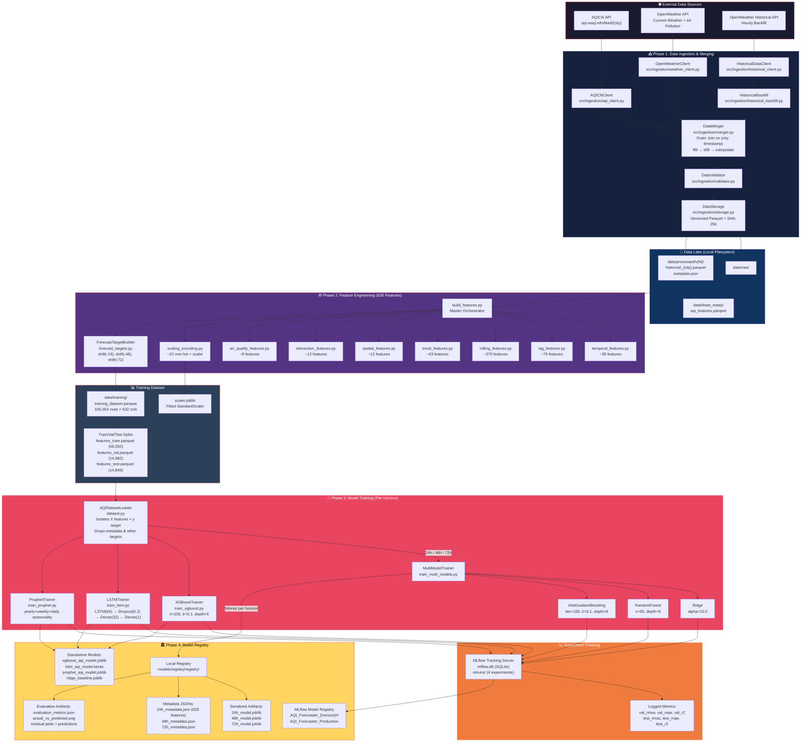
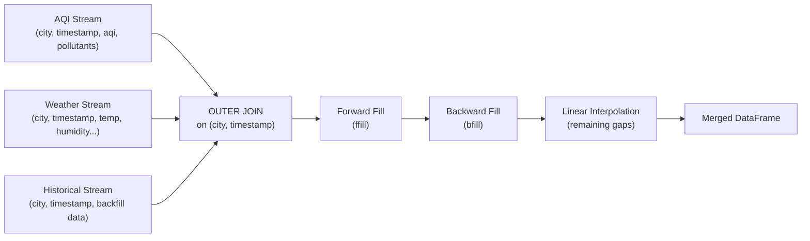
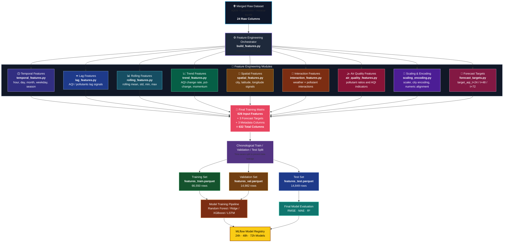
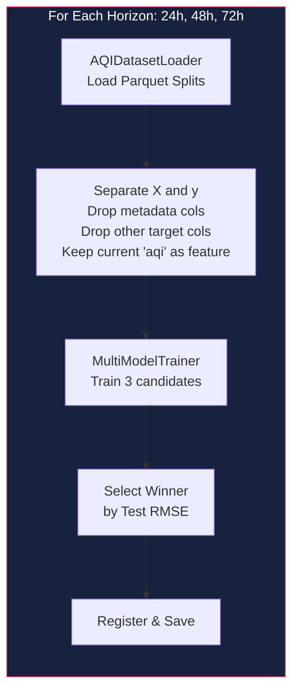
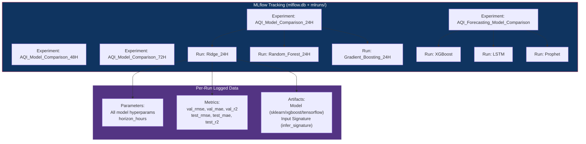
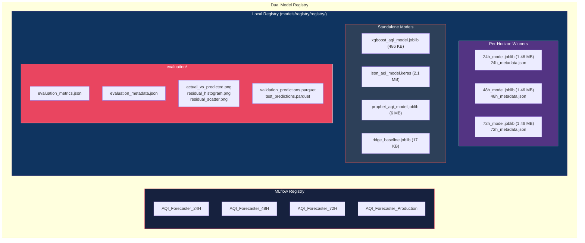

# AQI Forecasting MLOps Platform — End-to-End Pipeline Architecture

> [!NOTE]
> This document provides a complete technical breakdown of the data pipeline architecture from raw data ingestion through to the model registry. All details are extracted directly from the codebase at `d:\10Pearls\aqi-forecasting-mlops`.

---

## Master Architecture Diagram



---

## 1. Data Ingestion & Merging Pipeline

### 1.1 External API Data Sources

The platform pulls data from **two external APIs** covering **3 Pakistani cities**: Islamabad, Karachi, and Lahore.

| API | Endpoint | Client Module | Data Retrieved |
|-----|----------|---------------|----------------|
| **AQICN** | `https://api.waqi.info/feed/{city}/?token={key}` | [aqi_client.py](file:///d:/10Pearls/aqi-forecasting-mlops/src/ingestion/aqi_client.py) | AQI value, dominant pollutant, station ID, PM2.5, PM10, NO₂, SO₂, CO, O₃ |
| **OpenWeather Current** | `https://api.openweathermap.org/data/2.5/weather` | [weather_client.py](file:///d:/10Pearls/aqi-forecasting-mlops/src/ingestion/weather_client.py) | Temperature, feels_like, humidity, pressure, visibility, wind_speed, wind_degree, cloudiness |
| **OpenWeather Air Pollution** | `https://api.openweathermap.org/data/2.5/air_pollution` | [weather_client.py](file:///d:/10Pearls/aqi-forecasting-mlops/src/ingestion/weather_client.py) | Supplementary pollutant concentrations |
| **OpenWeather Historical** | `https://api.openweathermap.org/data/2.5/onecall/timemachine` | [historical_client.py](file:///d:/10Pearls/aqi-forecasting-mlops/src/ingestion/historical_client.py) | Hourly historical weather data for backfill |

> [!IMPORTANT]
> API keys are managed via Pydantic `SecretStr` in [settings.py](file:///d:/10Pearls/aqi-forecasting-mlops/src/configs/settings.py) with `.env` file loading. Keys: `AQICN_API_KEY`, `OPENWEATHER_API_KEY`.

### 1.2 API Client Architecture

All clients inherit from a base [APIClient](file:///d:/10Pearls/aqi-forecasting-mlops/src/ingestion/api_client.py) class:

```
APIClient (base)
  ├── AQICNClient      → Real-time AQI per city
  ├── OpenWeatherClient → Current weather + air pollution per city
  └── HistoricalDataClient → Date-range hourly historical weather
        └── HistoricalBackfill → Bulk multi-date backfill orchestrator
```

The base client provides:
- **Configurable retries** (default: 3) with exponential backoff
- **Configurable timeout** (default: 30s, max: 120s)
- **Session management** via `requests.Session`
- **Batch processing** (default batch_size: 100)

### 1.3 Historical Backfill Strategy

[HistoricalBackfill](file:///d:/10Pearls/aqi-forecasting-mlops/src/ingestion/historical_backfill.py) iterates day-by-day over a date range, calling the historical API for each `(city, date)` pair. The dataset spans **2022-07-21 → 2026-07-18** (~4 years of hourly data).

### 1.4 Data Merging Pipeline

[DataMerger](file:///d:/10Pearls/aqi-forecasting-mlops/src/ingestion/merger.py) (17,377 bytes — the largest ingestion module) performs multi-stream fusion:



**Key merge details:**
- **Join keys**: `(city, timestamp)`
- **Join type**: Outer join (preserves all timestamps from all sources)
- **Missing value strategy** (3-stage):
  1. **Forward fill** (`ffill`) — propagate last known value forward
  2. **Backward fill** (`bfill`) — fill remaining leading NaNs from next known value
  3. **Linear interpolation** — numeric-only interpolation for any remaining gaps

### 1.5 Data Validation

[DataValidator](file:///d:/10Pearls/aqi-forecasting-mlops/src/ingestion/validator.py) checks:
- **Completeness**: Missing value counts and percentages per column
- **Range validation**: Values within expected physical bounds
- **Duplicate detection**: Zero duplicates enforced
- **Timestamp continuity**: Gap detection between consecutive hourly records

Quality report output (actual from `data/training/quality_report.json`):
- 105,054 rows, 0 duplicates, 0 timestamp gaps
- Missing values: ~1,023 per pollutant column (~0.97%) — from `unknown` dominant pollutant records

### 1.6 Versioned Storage

[DataStorage](file:///d:/10Pearls/aqi-forecasting-mlops/src/ingestion/storage.py) manages an **immutable, versioned data lake**:

```
data/processed/
  ├── _backups/
  ├── v1/   → 3 rows (initial test)
  │   ├── features.parquet
  │   ├── features.csv
  │   ├── features.json
  │   └── metadata.json (SHA-256 checksums)
  ├── v2/ ... v12/
  └── v13/ → 264 rows (latest ingestion)
      ├── historical_islamabad.parquet
      ├── historical_islamabad_features.parquet
      └── metadata.json
```

Each version includes:
- **Parquet files** with schema: 24 columns (city, country, lat, lon, timestamp, weather features, AQI, pollutants, source, created_at)
- **`metadata.json`** with version, row count, column list, file sizes, and **SHA-256 checksums** for integrity verification

---

## 2. Feature Engineering & Transformation Pipeline

### 2.1 Pipeline Orchestration

The feature engineering pipeline is orchestrated by [build_features.py](file:///d:/10Pearls/aqi-forecasting-mlops/src/feature_engineering/build_features.py) which calls 9 specialized feature modules in sequence:



### 2.2 Feature Vector Breakdown (626 Features)

The 632-column dataset = **626 input features** + 3 target columns + 3 metadata columns:

| # | Category | Module | Feature Count | Feature Examples |
|---|----------|--------|:---:|---|
| 1 | **Base / Raw** | *(from ingestion)* | **~15** | `latitude`, `longitude`, `feels_like`, `humidity`, `pressure`, `visibility`, `wind_speed`, `wind_degree`, `cloudiness`, `aqi`, `station_id`, `pm25`, `pm10`, `no2`, `so2`, `co`, `o3` |
| 2 | **Temporal** | [temporal_features.py](file:///d:/10Pearls/aqi-forecasting-mlops/src/feature_engineering/temporal_features.py) | **~38** | `hour`, `day`, `month`, `day_of_week`, `is_weekend`, `year`, `minute`, `day_of_year`, `week_of_year`, `hour_sin`, `hour_cos`, `day_of_week_sin/cos`, `month_sin/cos`, `day_of_year_sin/cos`, `quarter`, `is_month_start/end`, `days_in_month`, `season_sin/cos`, `is_holiday`, `is_working_day`, `days_since_weekend`, `is_morning/afternoon/evening/night`, `is_morning_rush`, `is_evening_rush`, `is_rush_hour`, `is_q1-q4`, `is_first_half`, `is_second_half` |
| 3 | **Lag** | [lag_features.py](file:///d:/10Pearls/aqi-forecasting-mlops/src/feature_engineering/lag_features.py) | **~75** | `{var}_lag_{k}` for 10 variables × lag windows [1, 3, 6, 12, 24, 48, 72]. Variables: `aqi`, `pm25`, `pm10`, `no2`, `so2`, `co`, `o3`, `temperature`, `humidity`, `pressure`, `wind_speed` |
| 4 | **Rolling Window** | [rolling_features.py](file:///d:/10Pearls/aqi-forecasting-mlops/src/feature_engineering/rolling_features.py) | **~270** | `{var}_roll{stat}_{window}h` for 10 variables × 6 stats × 5 windows. Stats: `mean`, `std`, `min`, `max`, `median`, `ema`. Windows: [6h, 12h, 24h, 48h, 168h]. Also `{var}_rollrange_{window}h` |
| 5 | **Trend** | [trend_features.py](file:///d:/10Pearls/aqi-forecasting-mlops/src/feature_engineering/trend_features.py) | **~63** | `{var}_diff_{k}`, `{var}_pctchange_{k}`, `{var}_roc_{k}` for 7 pollutant vars × [1, 3, 6, 24] periods. Plus `{var}_momentum_3` for 7 variables |
| 6 | **Spatial** | [spatial_features.py](file:///d:/10Pearls/aqi-forecasting-mlops/src/feature_engineering/spatial_features.py) | **~12** | `lat_lon_product`, `city_Islamabad`, `city_Karachi`, `city_Lahore`, `station_{id}` (one-hot encoded station IDs: -1, 11739, 11765, 11790), `country_PK` |
| 7 | **Interaction** | [interaction_features.py](file:///d:/10Pearls/aqi-forecasting-mlops/src/feature_engineering/interaction_features.py) | **~12** | `temp_humidity_interaction`, `wind_pm25_interaction`, `pm25_per_wind`, `pressure_change_1h`, `dew_point`, `heat_index`, `pm25_pm10_ratio`, `no2_so2_ratio`, `co_no2_ratio`, `pm25_o3_ratio` |
| 8 | **Air Quality** | [air_quality_features.py](file:///d:/10Pearls/aqi-forecasting-mlops/src/feature_engineering/air_quality_features.py) | **~8** | `dominant_{pollutant}` (one-hot: co, no2, o3, pm10, pm25, so2, unknown), `pollution_index` |
| 9 | **Encoding** | [scaling_encoding.py](file:///d:/10Pearls/aqi-forecasting-mlops/src/feature_engineering/scaling_encoding.py) | **~22** | `day_of_week_name_{day}` (Mon–Sun), `season_{name}` (Monsoon, Autumn, Winter, Spring, Summer). Plus `StandardScaler` applied to all numeric features → saved as `scaler.joblib` |
| | **TOTAL** | | **626** | |

> [!TIP]
> The metadata/non-feature columns excluded from model input are defined in [constants.py](file:///d:/10Pearls/aqi-forecasting-mlops/src/utils/constants.py#L26-L34): `timestamp`, `city`, `country`, `created_at`, `source`, `aqi_category`, `dominant_pollutant`.

### 2.3 Target Variable Construction

[ForecastTargetBuilder](file:///d:/10Pearls/aqi-forecasting-mlops/src/training/forecast_targets.py) creates 3 direct forecast targets using **negative shift per city group**:

```python
# Per-city groupby shift: pulls future AQI value back to current row
df[f"target_aqi_t+{horizon}"] = df.groupby("city")["aqi"].shift(-horizon)
```

| Target Column | Meaning | Shift | NaN Tail |
|---|---|---|---|
| `target_aqi_t+24` | AQI 24 hours from now | `shift(-24)` | Last 24 rows per city |
| `target_aqi_t+48` | AQI 48 hours from now | `shift(-48)` | Last 48 rows per city |
| `target_aqi_t+72` | AQI 72 hours from now | `shift(-72)` | Last 72 rows per city |

### 2.4 Dataset Split & Persistence

The engineered dataset is **chronologically split** (no random shuffle — preserves temporal ordering):

| Split | File | Rows | Purpose |
|---|---|---:|---|
| Train | `data/training/features_train.parquet` (~127 MB) | 66,550 | Model fitting |
| Validation | `data/training/features_val.parquet` (~32 MB) | 14,982 | Hyperparameter tuning & early stopping |
| Test | `data/training/features_test.parquet` (~32 MB) | 14,849 | Final unbiased evaluation |

Additional artifacts in `data/training/`:
- `training_dataset.parquet` — Combined pre-split features (~2.4 MB)
- `scaler.joblib` — Fitted `StandardScaler` (~54 KB)
- `dataset_statistics.json` — Statistical summaries (mean, std, min, max per feature)
- `quality_report.json` — Data quality validation results
- `feature_build_report.json` — Feature pipeline execution metadata

### 2.5 Feast Feature Store Integration

A [Feast](file:///d:/10Pearls/aqi-forecasting-mlops/feature_repo/feature_store.yaml) feature store is configured for online/offline serving:

- **Provider**: Local (SQLite-backed)
- **Entity**: `city` (join key)
- **Feature View**: `aqi_features` with 26 base schema fields
- **Online Store**: `data/online_store.db` (SQLite)
- **Offline Source**: `data/feast_ready/aqi_features.parquet`
- **TTL**: 365 days

---

## 3. Model Training & Horizon Strategy

### 3.1 Training Pipeline Flow



### 3.2 Dataset Loading & Feature Isolation

[AQIDatasetLoader](file:///d:/10Pearls/aqi-forecasting-mlops/src/training/dataset.py) performs critical data preparation:

1. Loads 3 pre-split Parquet files
2. Validates schema consistency across splits
3. **For horizon-specific training** (e.g., 24h):
   - Sets active target: `target_aqi_t+24`
   - Drops rows where target is NaN (future unavailable)
   - Drops other target columns (`target_aqi_t+48`, `target_aqi_t+72`) from X to **prevent feature leakage**
   - Drops metadata columns (timestamp, city, etc.)
   - **Keeps current raw `aqi`** as a valid predictor in X
4. Returns frozen `DatasetSplits` dataclass

### 3.3 ML Algorithms & Hyperparameters

Six algorithms are trained, with the **first three competing** in the multi-model comparison per horizon:

| Algorithm | Class | Module | Key Hyperparameters | Input Format |
|---|---|---|---|---|
| **Ridge Regression** | `Ridge` | [train_multi_models.py](file:///d:/10Pearls/aqi-forecasting-mlops/src/training/train_multi_models.py) | `alpha=10.0`, `random_state=42` | 2D Tabular |
| **Random Forest** | `RandomForestRegressor` | [train_multi_models.py](file:///d:/10Pearls/aqi-forecasting-mlops/src/training/train_multi_models.py) | `n_estimators=50`, `max_depth=8`, `n_jobs=-1` | 2D Tabular |
| **HistGradientBoosting** | `HistGradientBoostingRegressor` | [train_multi_models.py](file:///d:/10Pearls/aqi-forecasting-mlops/src/training/train_multi_models.py) | `max_iter=100`, `lr=0.1`, `max_depth=6` | 2D Tabular |
| **XGBoost** | `XGBRegressor` | [train_xgboost.py](file:///d:/10Pearls/aqi-forecasting-mlops/src/training/train_xgboost.py) | `n_estimators=100`, `lr=0.1`, `max_depth=6`, `n_jobs=-1` | 2D Tabular |
| **LSTM** | `Sequential` (Keras) | [train_lstm.py](file:///d:/10Pearls/aqi-forecasting-mlops/src/training/train_lstm.py) | LSTM(64) → Dropout(0.2) → Dense(32, relu) → Dense(1, linear). Adam, MSE, epochs=15, batch=64, EarlyStopping(patience=3) | 3D `(N, 1, Features)` |
| **Prophet** | `Prophet` | [train_prophet.py](file:///d:/10Pearls/aqi-forecasting-mlops/src/training/train_prophet.py) | `yearly/weekly/daily_seasonality=True`, `changepoint_prior_scale=0.05` | 2D `(ds, y)` |
| **Ridge Baseline** | `Ridge` | [Ridgetrain.py](file:///d:/10Pearls/aqi-forecasting-mlops/src/training/Ridgetrain.py) | `alpha=10.0` (standalone baseline) | 2D Tabular |

### 3.4 MLflow Experiment Tracking



**MLflow Configuration:**
- **Backend Store**: SQLite at `mlflow.db`
- **Artifact Store**: Local `mlruns/` directory (4 experiments)
- **Model Logging**: `mlflow.sklearn.log_model()`, `mlflow.xgboost.log_model()`, `mlflow.tensorflow.log_model()`
- **Signature**: Auto-inferred via `mlflow.models.infer_signature(X_val, predictions)`

### 3.5 Winner Selection

Per-horizon, the [MultiModelTrainer](file:///d:/10Pearls/aqi-forecasting-mlops/src/training/train_multi_models.py) selects the **lowest test RMSE** candidate:

```python
if test_metrics["rmse"] < best_test_rmse:
    best_test_rmse = test_metrics["rmse"]
    best_model_name = model_name
    best_model_artifact = model_instance
    best_run_id = run.info.run_id
```

The winner is then:
1. **Registered in MLflow Registry** as `AQI_Forecaster_{horizon}H`
2. **Saved locally** as `{horizon}h_model.joblib` + `{horizon}h_metadata.json`

---

## 4. Model Registry & Storage

### 4.1 Dual Registry Architecture

The platform maintains **two parallel registries**:



### 4.2 Local Registry Artifacts

#### Per-Horizon Model Artifacts (`{horizon}h_model.joblib` + `{horizon}h_metadata.json`)

The winning model per horizon is serialized with `joblib.dump()`. The metadata JSON contains:

```json
{
    "model_version": "1.0.0",
    "algorithm": "Gradient_Boosting",
    "horizon_hours": 24,
    "feature_names": ["latitude", "longitude", ... ],  // Full 626-feature manifest
    "feature_count": 626,
    "best_test_rmse": 18.5467,
    "training_timestamp": "2026-07-23T16:54:36.162907+00:00"
}
```

> [!IMPORTANT]
> The metadata JSON includes the **complete ordered feature manifest** (all 626 feature names). This is used by [ModelEvaluator](file:///d:/10Pearls/aqi-forecasting-mlops/src/training/evaluate.py) for **strict schema verification** at inference time — checking feature count, name matching, ordering, and numeric dtypes.

#### Standalone Model Artifacts

| Artifact | Format | Size | Algorithm |
|---|---|---:|---|
| `xgboost_aqi_model.joblib` | Joblib | 486 KB | XGBoost (feature_count: 603) |
| `lstm_aqi_model.keras` | Keras native | 2.1 MB | LSTM Sequential |
| `prophet_aqi_model.joblib` | Joblib | 6 MB | Facebook Prophet |
| `ridge_baseline.joblib` | Joblib | 17 KB | Ridge (baseline) |

#### Evaluation Artifacts (`evaluation/`)

| File | Contents |
|---|---|
| `evaluation_metrics.json` | RMSE, MAE, MSE, R², explained variance, median/max absolute error, residual statistics for both validation and test splits |
| `evaluation_metadata.json` | Model name/version, timestamp, feature count, sample counts, sklearn/Python versions |
| `actual_vs_predicted.png` | Scatter plot of ground truth vs predictions |
| `residual_histogram.png` | Distribution of prediction residuals |
| `residual_scatter.png` | Residuals vs predicted values |
| `validation_predictions.parquet` | Actual, predicted, and residual columns for validation set |
| `test_predictions.parquet` | Actual, predicted, and residual columns for test set |

### 4.3 Custom Model Registry (Versioning)

[ModelRegistry](file:///d:/10Pearls/aqi-forecasting-mlops/src/training/registry.py) provides a custom versioning and promotion system:

- **Catalog**: `model_catalog.json` with all registered model records
- **Versioning**: Auto-incrementing semantic versions (`v1.0.0` → `v1.0.1`)
- **Lifecycle**: Staging → Production → Archived
- **Artifact Management**: Copies model files to versioned registry paths

---

## 5. End-to-End Pipeline Orchestration

### 5.1 CLI Entry Points

[main.py](file:///d:/10Pearls/aqi-forecasting-mlops/main.py) provides 5 CLI commands:

| Command | Handler | Description |
|---|---|---|
| `python main.py train --all` | `handle_train()` | Train models for all horizons (24h, 48h, 72h) |
| `python main.py evaluate --horizon 24` | `handle_evaluate()` | Evaluate registered models |
| `python main.py predict payload.json` | `handle_predict()` | Single-payload inference |
| `python main.py forecast --hours 72` | `handle_forecast()` | Multi-step forward forecast |
| `python main.py pipeline` | `handle_pipeline()` | Full end-to-end pipeline |

### 5.2 Full Pipeline Sequence

The `pipeline` command triggers [run_end_to_end_pipeline()](file:///d:/10Pearls/aqi-forecasting-mlops/src/training/run_pipeline.py):

```mermaid
sequenceDiagram
    participant CLI as main.py pipeline
    participant FE as build_features_pipeline()
    participant LOOP as Horizon Loop [24, 48, 72]
    participant LOAD as AQIDatasetLoader
    participant TRAIN as MultiModelTrainer
    participant MLFLOW as MLflow Tracking
    participant REG as Local Registry

    CLI->>FE: 1. Feature Engineering
    FE-->>FE: Build 626 features + 3 targets
    FE-->>FE: Chronological train/val/test split
    FE-->>FE: Save Parquet files + scaler.joblib

    loop For horizon in [24, 48, 72]
        CLI->>LOOP: 2. Training Loop
        LOOP->>LOAD: load_prepared_splits(horizon)
        LOAD-->>LOAD: Load Parquets, drop NaN targets
        LOAD-->>LOAD: Isolate X (626 features) and y (target)
        LOAD->>TRAIN: DatasetSplits
        TRAIN-->>TRAIN: Fit Ridge, RF, HistGB
        TRAIN-->>TRAIN: Evaluate val + test metrics
        TRAIN->>MLFLOW: Log params, metrics, model artifacts
        TRAIN-->>TRAIN: Select winner (lowest test RMSE)
        TRAIN->>MLFLOW: Register winner model
        TRAIN->>REG: Save {horizon}h_model.joblib + metadata.json
    end

    CLI-->>CLI: Print leaderboard & timing
```

---

## 6. Complete Source File Map

### Core Modules

| Module | File | Responsibility |
|---|---|---|
| **CLI** | [main.py](file:///d:/10Pearls/aqi-forecasting-mlops/main.py) | Master CLI orchestrator |
| **Settings** | [settings.py](file:///d:/10Pearls/aqi-forecasting-mlops/src/configs/settings.py) | Pydantic config with .env + YAML sources |
| **Constants** | [constants.py](file:///d:/10Pearls/aqi-forecasting-mlops/src/utils/constants.py) | Paths, column schema, split sizes |

### Ingestion Pipeline (`src/ingestion/`)

| File | Key Class | Responsibility |
|---|---|---|
| [api_client.py](file:///d:/10Pearls/aqi-forecasting-mlops/src/ingestion/api_client.py) | `APIClient` | Base HTTP client with retries |
| [aqi_client.py](file:///d:/10Pearls/aqi-forecasting-mlops/src/ingestion/aqi_client.py) | `AQICNClient` | AQICN API integration |
| [weather_client.py](file:///d:/10Pearls/aqi-forecasting-mlops/src/ingestion/weather_client.py) | `OpenWeatherClient` | OpenWeather API integration |
| [historical_client.py](file:///d:/10Pearls/aqi-forecasting-mlops/src/ingestion/historical_client.py) | `HistoricalDataClient` | Historical weather backfill |
| [historical_backfill.py](file:///d:/10Pearls/aqi-forecasting-mlops/src/ingestion/historical_backfill.py) | `HistoricalBackfill` | Bulk date-range backfill |
| [merger.py](file:///d:/10Pearls/aqi-forecasting-mlops/src/ingestion/merger.py) | `DataMerger` | Multi-stream outer join + fill |
| [validator.py](file:///d:/10Pearls/aqi-forecasting-mlops/src/ingestion/validator.py) | `DataValidator` | Data quality validation |
| [storage.py](file:///d:/10Pearls/aqi-forecasting-mlops/src/ingestion/storage.py) | `DataStorage` | Versioned Parquet + checksums |
| [run_pipeline.py](file:///d:/10Pearls/aqi-forecasting-mlops/src/ingestion/run_pipeline.py) | — | Ingestion orchestrator |

### Feature Engineering (`src/feature_engineering/`)

| File | Key Function | Features Generated |
|---|---|---|
| [build_features.py](file:///d:/10Pearls/aqi-forecasting-mlops/src/feature_engineering/build_features.py) | `FeatureBuilder.build_all()` | Master orchestrator |
| [temporal_features.py](file:///d:/10Pearls/aqi-forecasting-mlops/src/feature_engineering/temporal_features.py) | `add_temporal_features()` | ~38 time/calendar features |
| [lag_features.py](file:///d:/10Pearls/aqi-forecasting-mlops/src/feature_engineering/lag_features.py) | `add_lag_features()` | ~75 lagged variable features |
| [rolling_features.py](file:///d:/10Pearls/aqi-forecasting-mlops/src/feature_engineering/rolling_features.py) | `add_rolling_features()` | ~270 rolling window stats |
| [trend_features.py](file:///d:/10Pearls/aqi-forecasting-mlops/src/feature_engineering/trend_features.py) | `add_trend_features()` | ~63 diff/pctchange/ROC/momentum |
| [spatial_features.py](file:///d:/10Pearls/aqi-forecasting-mlops/src/feature_engineering/spatial_features.py) | `add_spatial_features()` | ~12 location/city encodings |
| [interaction_features.py](file:///d:/10Pearls/aqi-forecasting-mlops/src/feature_engineering/interaction_features.py) | `add_interaction_features()` | ~12 cross-variable interactions |
| [air_quality_features.py](file:///d:/10Pearls/aqi-forecasting-mlops/src/feature_engineering/air_quality_features.py) | `add_air_quality_features()` | ~8 pollutant-derived features |
| [scaling_encoding.py](file:///d:/10Pearls/aqi-forecasting-mlops/src/feature_engineering/scaling_encoding.py) | `apply_scaling_encoding()` | ~22 one-hot + StandardScaler |

### Training & Registry (`src/training/`)

| File | Key Class | Responsibility |
|---|---|---|
| [forecast_targets.py](file:///d:/10Pearls/aqi-forecasting-mlops/src/training/forecast_targets.py) | `ForecastTargetBuilder` | Create target_aqi_t+{24,48,72} |
| [dataset.py](file:///d:/10Pearls/aqi-forecasting-mlops/src/training/dataset.py) | `AQIDatasetLoader` | Load splits, isolate X/y |
| [train_multi_models.py](file:///d:/10Pearls/aqi-forecasting-mlops/src/training/train_multi_models.py) | `MultiModelTrainer` | Ridge/RF/HistGB comparison |
| [train_xgboost.py](file:///d:/10Pearls/aqi-forecasting-mlops/src/training/train_xgboost.py) | `XGBoostTrainer` | Standalone XGBoost |
| [train_lstm.py](file:///d:/10Pearls/aqi-forecasting-mlops/src/training/train_lstm.py) | `LSTMTrainer` | Standalone LSTM |
| [train_prophet.py](file:///d:/10Pearls/aqi-forecasting-mlops/src/training/train_prophet.py) | `ProphetTrainer` | Standalone Prophet |
| [Ridgetrain.py](file:///d:/10Pearls/aqi-forecasting-mlops/src/training/Ridgetrain.py) | `RidgeBaselineTrainer` | Ridge baseline |
| [evaluate.py](file:///d:/10Pearls/aqi-forecasting-mlops/src/training/evaluate.py) | `ModelEvaluator` | Schema validation + evaluation |
| [registry.py](file:///d:/10Pearls/aqi-forecasting-mlops/src/training/registry.py) | `ModelRegistry` | Local versioned model catalog |
| [run_pipeline.py](file:///d:/10Pearls/aqi-forecasting-mlops/src/training/run_pipeline.py) | `run_end_to_end_pipeline()` | E2E training orchestrator |

---

## 7. Data Statistics Summary

| Metric | Value |
|---|---|
| **Cities** | Islamabad, Karachi, Lahore (35,018 rows each) |
| **Total Rows** | 105,054 |
| **Date Range** | 2022-07-21 → 2026-07-18 (~4 years hourly) |
| **Input Features** | 626 |
| **Target Columns** | 3 (`target_aqi_t+24/48/72`) |
| **Total Columns** | 632 (626 features + 3 targets + 3 metadata) |
| **Train Split** | 66,550 rows (~63%) |
| **Validation Split** | 14,982 rows (~14%) |
| **Test Split** | 14,849 rows (~14%) |
| **Missing Values** | ~0.97% per pollutant column (1,023 rows) |
| **Dominant Pollutant** | PM2.5 (87.8% of records) |
| **Best Test RMSE** | 18.5467 (Gradient Boosting, 24h horizon) |
